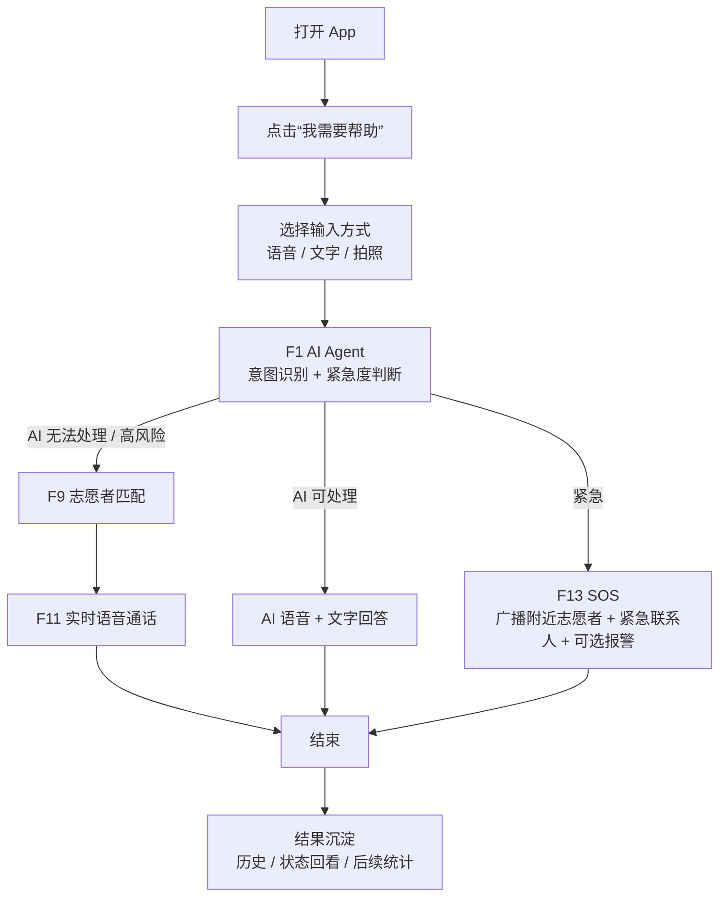
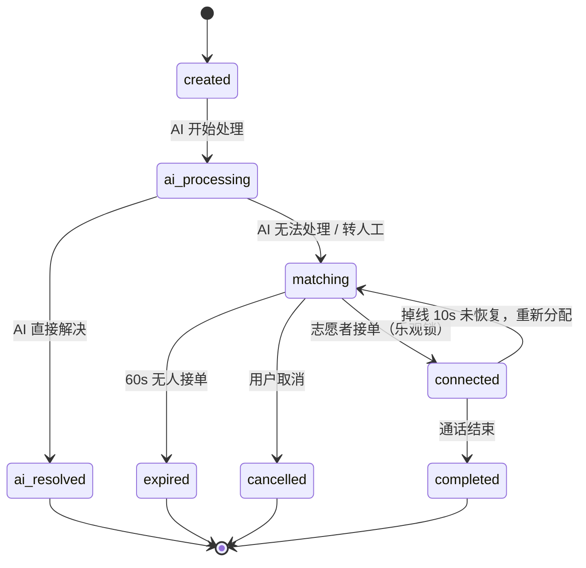

# AGENTS.md - 共感 LinkAble 项目实施准则（v2026.04）

> 依据文档：`共感LinkAble_PRD_v1_2.md`、`项目深度分析报告.md`  
> 适用范围：`E:\project\LinkLab` 整个 workspace  
> 目标：将当前项目从“多线并行的竞赛 Demo 代码库”收敛为“范围清晰、主线稳定、可持续交付”的 MVP 实施基线。

## 1. 项目当前范围（MVP 6 大核心功能）

依据：`共感LinkAble_PRD_v1_2.md` §3.2、§4.1–§4.6  
本项目当前唯一必须交付的产品范围只有以下 6 个功能。默认导航、默认开发资源、默认测试资源只服务这 6 项。

| ID | 功能 | 当前定义 | 验收标准（必须全部满足） | 依据 |
|---|---|---|---|---|
| `F1` | AI Agent 智能对话 | 单一对话入口，统一承接 OCR、场景描述、颜色识别、钞票识别、翻译、环境描述、导航、药品确认、紧急词检测 | 9 类意图识别准确率 `>= 85%`；紧急词误识率 `<= 2%`；首次响应 `<= 3s`；连续 3 轮上下文正确；AI 无法处理时 `100%` 可转人工；繁中 OCR `>= 90%`；弱网下基础 OCR + 紧急词检测仍可用 | PRD §3.2、§4.1 |
| `F9` | 志愿者匹配引擎 | AI 无法处理时，基于紧急度 + 距离 + 信誉分匹配 Top 5 在线志愿者 | 匹配计算耗时 `<= 500ms`（50 人池）；30 秒首次匹配成功率 `>= 70%`；连续 3 次拒接或超时自动降权；10 个志愿者同时抢单时只能 1 个成功 | PRD §3.2、§4.2 |
| `F11` | 实时语音通话 | 匹配成功后建立 WebRTC 语音通话；视频和屏幕共享不属于 MVP 主交付 | 信令交换到通话建立 `<= 5s`；3G 弱网稳定性 `>= 95%`；掉线后 10 秒未恢复时状态正确回到 `matching` 并可重新分配 | PRD §3.2、§4.3 |
| `F13` | SOS 紧急呼救 | 一键或紧急意图触发，广播附近志愿者并通知紧急联系人，必要时联通 110/120 | 触发到首个志愿者收到推送 `<= 3s`；紧急联系人短信延迟 `<= 10s`；App 未启动时仍可触发；必须有 10 秒误触撤销窗口 | PRD §3.2、§4.4 |
| `F33` | 登录与无障碍偏好 | 手机号验证码登录 + 首次引导 + 简化实名与偏好设置三合一 | 登录 + 引导全流程 `<= 90s`；3 步引导可跳过、可稍后补全；视障用户可通过读屏独立完成注册与偏好设置 | PRD §3.2、§4.5 |
| `F36` | 全局无障碍适配 | 跨所有页面的强制技术约束，不是附加优化项 | 所有交互元素必须有 `Semantics`；对比度 `>= 7:1`；触摸目标 `>= 48x48dp`；支持 `200%` 字体缩放不破版；焦点顺序合理；禁止强制倒计时选择；自动轮播禁用或可暂停；图片必须有可理解文本；错误状态必须颜色+图标+文字三重表达；读屏测试通过 | PRD §3.2、§4.6 |

**实施硬约束：**
- 默认首页、默认路由、默认构建、默认测试，只保障以上 6 项。
- 不在本表中的功能，不得进入主导航，不得抢占 P0/P1 资源，不得阻塞演示主线。
- 若代码与 PRD 冲突，以本表为准，而不是以既有实现为准。

## 2. 已明确砍掉 / 降级功能清单

依据：`共感LinkAble_PRD_v1_2.md` §3.4  
以下功能已被 PRD 明确舍弃或降级。当前代码中如存在对应模块，必须按表中指令处理，不得继续按“独立产品功能”推进。

| 原功能 | PRD 决策 | 当前代码处置指令 | 典型现有模块 |
|---|---|---|---|
| `F14` 帮助档案 | 降级为自动生成结果，不再是独立产品功能 | 保留为查询/历史展示层；不得继续扩展成独立复杂模块 | `services/user_center/help_archive_service.dart`、`SeekerCenterScreen` 中历史视图 |
| `F15` 安心积分 | 砍掉 | 从默认导航和主交付移除；相关 service/tab/model 停止继续开发 | `PointsService`、`PointsTab`、`PointTransactionModel` |
| `F20` 善意时间线 / `F21` 徽章 / `F23` 排班 | 砍掉 | 从志愿者中心默认页签中移除；相关逻辑归档，不占用 MVP 资源 | `TimelineService`、`BadgeService`、`ScheduleService`、`VolunteerCenterScreen` 对应 Tab |
| `F24–F27` 社群模块 | 降级为“硬编码 3 条精选故事” | 交互式社群、群聊、地区社区、新手村全部下线或隐藏；只保留静态精选故事展示 | `CommunityScreen`、`interest_groups_screen.dart`、`regional_community_screen.dart`、`group_chat_screen.dart`、`newbie_village_screen.dart`、`training_scenario_screen.dart` |
| `F29` 通话录音 + AI 检测 | 延后到 `V2.0` | 录音能力不进入 MVP 构建与主流程；所有录音相关逻辑禁止阻塞 F11 | `services/security/call_recording_service.dart`、`services/webrtc/call_recording_service.dart` |
| `F34` 消息推送 | 降级为基础设施 | 只能作为 F9/F11/F13 的实现细节存在；不得做独立页面、独立史诗、独立产品展示 | `push_notification_service.dart`、相关 Edge Functions |
| `F35` 运营后台 | 用 Supabase Dashboard 替代 | `admin_dashboard` 不属于竞赛 MVP 主交付；停止新增功能，避免反向绑架主应用 | `linklab/admin_dashboard/`、`linklab/lib/admin/` |
| `F28` 多级认证 | 简化并并入 `F33` | 只保留“手机号实名”一档；专业技能认证和复杂审核流程不得进入 MVP 主线 | `auth_service.dart`、志愿者高级认证相关逻辑 |

**补充说明：**
- `F10 / F18 / F19 / F22 / F30 / F31` 属于 PRD §3.3 的 `V1.0` 追加能力，不是当前 MVP 主交付。
- 这些 V1.0 模块即使已存在代码，也不得进入竞赛默认导航、默认构建路径和默认验收口径。
- 竞赛版 UI 中不得出现“功能很多但都半成品”的状态；宁可隐藏，也不要半开。

## 3. 核心设计原则（必须 100% 贯彻）

依据：`共感LinkAble_PRD_v1_2.md` §2、§4.6  
以下原则按优先级执行。发生冲突时，上位原则覆盖下位原则。

1. **无障碍优先于美学**：读屏用户无法使用的 UI 设计即失败。
2. **AI 优先，人性兜底**：80% 场景 AI 即时响应，永远保留一键转人工。
3. **降低认知负担 > 展示功能**：每页最多 1 个主动作；决策时间 `<= 3s`。
4. **隐私默认最强**：最小数据、默认匿名、7 天过期。
5. **安全贯穿架构而非补丁**：举报、降权、黑名单属于架构，不是后补。
6. **志愿者是用户不是资源**：不能以压榨排班和时长换取指标。
7. **紧急流程必须可离线触发**：SOS 与紧急拨号在断网仍需可用。
8. **对错误宽容，对故障透明**：所有失败都必须有明确提示与降级路径。
9. **优先放弃，不是优先增加**：任何新增功能都必须通过“没它 MVP 能不能演示”的测试。
10. **F36 是跨页面强制要求**：无障碍不是视觉优化，不允许“主流程先不做，最后补”。
11. **Demo-first 是当前最高工程策略**：竞赛版优先保障“可点击、可讲述、可闭环”；真实集成不完整时，必须提供本地稳定 fallback。

**执行口径：**
- 范围收缩优先于架构炫技。
- 主流程稳定优先于边缘场景完整。
- 用户可见状态变化优先于隐形逻辑完整。
- 如果一个实现不能进入 3 分钟演示脚本，就不应拥有 P0 优先级。

## 4. 技术实现准则（针对当前代码现状）

依据：`共感LinkAble_PRD_v1_2.md` §5、§6、§13.2；`项目深度分析报告.md` §2、§4、§6、§8、§9

### 4.1 状态管理

- **必须全局使用 Riverpod。**
- 主入口必须改为：`ProviderScope(child: LinkLabApp())`。
- 新增状态逻辑只允许使用 `Provider` / `StateNotifierProvider` / `NotifierProvider` / `AsyncNotifierProvider`。
- **禁止继续新增** `ChangeNotifier` 业务状态、裸 `setState` 流程状态、以及新的 service singleton。
- 现有 `AppSessionService`、`DemoCallService` 等可在过渡期被 Riverpod provider 包装，但不得继续扩散这种模式。
- UI 层不得直接 new service，也不得直接依赖全局单例作为唯一状态源。

### 4.2 Demo / Real 双轨

- **竞赛版只保留 Demo 主线。**
- 默认导航、默认路由、默认首页只允许指向 demo 可跑通页面。
- `real_*` 页面、真实 WebRTC、真实推送、真实 Supabase 直连逻辑，默认视为实验性骨架，不得阻塞竞赛交付。
- 当真实依赖不存在、未初始化或不稳定时，必须自动回退到本地 demo 数据。
- 每个关键流程必须有“可见状态变化”：进入、处理中、成功、失败、回看落点，缺一不可。

### 4.3 无障碍

- 所有页面必须满足 `F36` 的全部要求，不允许“主流程先忽略无障碍”。
- 所有交互控件必须有明确 `Semantics` 标签与 hint。
- 所有交互元素触摸目标必须接近或达到 `48x48dp`。
- 对比度必须 `>= 7:1`；禁止仅依赖颜色表达状态。
- 必须支持系统读屏、动态字体和 `200%` 缩放。
- 焦点顺序必须符合视觉与操作逻辑。
- 禁止强制倒计时选择；唯一允许的倒计时例外是 PRD 明确批准的 **SOS 误触撤销窗口**。

### 4.4 Supabase

- **根目录 `supabase/` 是唯一 schema source of truth。**
- `linklab/supabase/` 视为历史分叉，必须归档、删除或停止执行；不得与根 `supabase/` 并行维护。
- 所有数据库字段、Edge Function、客户端查询必须与 PRD §6.3 的 MVP 表结构一致。
- 当前 MVP 只允许围绕以下核心表收敛：`users`、`volunteer_profiles`、`help_requests`、`emergency_contacts`、`virtual_identities`。
- 新增字段/表前必须先更新根 `supabase/` migration，再更新调用代码；禁止“代码先写，schema 以后再补”。

### 4.5 服务层

- **禁止继续新增 service 单例。**
- 同一业务能力只能暴露一个统一入口，优先收敛为 `unified_*` facade 或 provider-backed controller。
- UI 层只允许依赖“统一接口”，不得同时知道 `demo_*` 与 `real_*` 两套实现。
- 若能力已存在多套实现，下一步工作应优先“合并或隔离”，而不是再加第三套。
- 所有与 MVP 无关的 service 必须降级为非默认依赖，不得出现在主页面初始化链路。

### 4.6 错误处理与日志

- **统一使用 `AppLogger`。**
- 禁止新增 `print` / `debugPrint` 作为正式日志通道。
- 所有异步流程必须暴露清晰的 `loading / success / empty / error / retry` 状态。
- 任何失败都必须给用户可理解文案和可执行的降级路径，不得静默吞错。
- 日志中禁止输出真实敏感信息；需最小化记录上下文，并优先记录匿名 ID / request ID / feature name。

## 5. 核心数据流与状态机

依据：`共感LinkAble_PRD_v1_2.md` §5.1、§5.2  
以下流程和状态机是当前 MVP 的唯一正确版本。页面、provider、service、数据库状态都必须与其保持一致。

### 5.1 求助端到端流程



**流程实现要求：**
- 不允许出现“AI 失败后没有去路”的死路。
- `SOS` 不走普通 F9 匹配公式，而是广播型流程。
- `F33` 登录与偏好必须可在首次使用时完成，但不得阻塞竞赛 3 分钟主演示路径。
- 所有阶段都必须在 UI 上有可见反馈，而不是只更新内存状态。

### 5.2 `help_request` 状态机



| 当前状态 | 触发事件 | 下一状态 | UI/实现要求 |
|---|---|---|---|
| `created` | AI 开始处理 | `ai_processing` | 必须显示“AI 正在分析” |
| `ai_processing` | AI 能处理 | `ai_resolved` | 必须展示答案与“已解决”结果态 |
| `ai_processing` | AI 不能处理 | `matching` | 必须进入匹配页并允许用户取消 |
| `matching` | 志愿者接单（乐观锁） | `connected` | 只能有 1 个成功接单者 |
| `matching` | 60s 无人接单 | `expired` | MVP 阶段终态，明确提示“稍后再试” |
| `matching` | 用户取消 | `cancelled` | 必须有取消成功的可见反馈 |
| `connected` | 通话结束 | `completed` | 必须有完成态与结果回看落点 |
| `connected` | 掉线 10s 未恢复 | `matching` | 必须自动重回匹配而非静默失败 |

**状态机铁律：**
- 不允许新增 PRD 未定义的主状态并挂到 UI 主链路。
- 所有状态必须可回溯到 UI 文案、日志和数据表记录。
- `ai_resolved / completed / cancelled / expired` 视为终态。

## 6. 当前代码风险与必须立即处理的 P0 问题

依据：`项目深度分析报告.md` §8  
以下严重与高风险项目，在竞赛版中一律视为**必须立即处理**的问题。

| 等级 | 风险（摘自深度分析报告 §8） | 当前工程指令 |
|---|---|---|
| 严重 | `Riverpod` 已使用但全局没有 `ProviderScope` | 立即修复入口；所有可达 `ConsumerWidget/ConsumerStatefulWidget` 页面必须恢复可运行 |
| 严重 | 数据库 schema 与 Edge Function / 客户端代码不一致 | 在继续任何真实后端开发前，先统一字段与 migration；否则停止扩展真实路径 |
| 严重 | 存在两套 Supabase 定义且互相冲突 | 根 `supabase/` 立即收口为唯一事实来源；`linklab/supabase/` 停用 |
| 严重 | 多个关键表在代码中被引用但 migration 未创建 | 所有不存在的表一律不得继续在主链路调用；先补 migration 或回退到 demo |
| 高 | 资源文件与代码引用严重不一致 | 补齐资源或统一替换为文本/占位图回退；禁止运行时找不到资源 |
| 高 | 多套并行实现导致维护失控 | 默认主链路冻结为 demo；重复实现必须收敛或隔离 |
| 高 | 社区模块大量硬编码用户 ID | 一律接入当前会话或从主导航移除；不得继续保留 `current_user_id` 占位逻辑 |
| 高 | 真实通话与信令代码存在 SDK 适配错误 | 真实通话不进入竞赛主线；如保留代码，必须标记为 experimental 并隔离 |

## 7. 修复优先级（与深度分析报告 §9 完全一致）

依据：`项目深度分析报告.md` §9

### P0（立即）

1. 统一 Supabase schema 的唯一事实来源
2. 修复 `ProviderScope` 缺失与所有可达 Riverpod 页面
3. 做一次全仓资源清单核对，补齐或统一回退资源

### P1（1-3 天）

1. 冻结 demo/real 边界，明确“比赛版只保留哪条主线”
2. 把社区/社群模块全部接入 `AppSessionService` 当前用户
3. 补齐 5 条关键闭环测试：启动/登录、AI->转人工、通话评价、异步留言、SOS

### P2（交付前）

1. 清理 `flutter analyze` 高噪音问题
2. 统一日志与错误处理策略，减少 `print`
3. 规范配置与密钥管理

### 实施节奏补充（按深度分析报告 §9 的建议顺序）

```text
第 1 批（立即）
-> ProviderScope
-> 资源补齐
-> current_user_id 清理
-> 明确比赛交付只走 demo 主线

第 2 批（1-3 天）
-> 统一 Supabase source of truth
-> 删除/隔离重复实现
-> 修复真实匹配/信令最关键字段不一致

第 3 批（交付前）
-> 关键流程测试
-> analyze 噪音清理
-> 演示脚本与实际资源/页面逐项对齐
```

## 8. 演示闭环要求（竞赛专用）

依据：`共感LinkAble_PRD_v1_2.md` §13.2  
竞赛版唯一验收标准之一：**3 分钟演示脚本必须 100% 可跑通，且不依赖外部不可控服务。**

| 时间 | 必跑动作 | 页面/能力要求 | 降级要求 |
|---|---|---|---|
| `0:00–0:20` | 打开 App，大按钮吸睛 | 首页必须立即可见；大按钮、语义标签、高对比、读屏文案齐全 | 若登录是必须前置，则必须使用预置会话，不得现场卡在注册 |
| `0:20–0:50` | 语音求助“帮我读药品盒”→ AI 识别朗读 | `F1` OCR 路径必须稳定；返回文字 + 语音输出 | 不依赖真实 OCR key 时必须走本地 demo 响应 |
| `0:50–1:30` | “我面前是什么”→ 场景描述 | `F1` 场景描述路径必须稳定 | 无真实多模态时必须返回本地固定演示结果 |
| `1:30–2:10` | 复杂需求 → `F9` 匹配 → `F11` 通话 | 匹配页、通话页、状态变化必须完整可见 | 默认走 demo matching/demo call，不允许真实 WebRTC 阻塞 |
| `2:10–2:40` | `F13` SOS 演示（Mock 模式） | 必须显示广播、联系人通知、误触撤销窗口 | 允许 Mock，但必须让评审看到明确状态变化 |
| `2:40–3:00` | 展示未来蓝图 | 只能展示 `V1.0` 清单，不得把未实现功能冒充已完成 | 使用静态页面/卡片即可，不需要真实后台 |

**竞赛版强制规则：**
- 所有演示数据必须可本地复现、可重复执行、结果稳定。
- 主演示链路不得依赖真实 API key、真实 Supabase 初始化、真实推送、真实 WebRTC 建链。
- 所有演示步骤都必须有“可见状态变化”和“结束落点”。
- 不在 3 分钟脚本中的功能，不得阻塞首页、主导航、构建或演示准备。
- `F33` 必须已具备，但默认通过预置会话或预先完成的引导进入主演示，避免浪费演示时长。

本文档为项目唯一技术实施事实来源，优先级高于任何其他文档。
