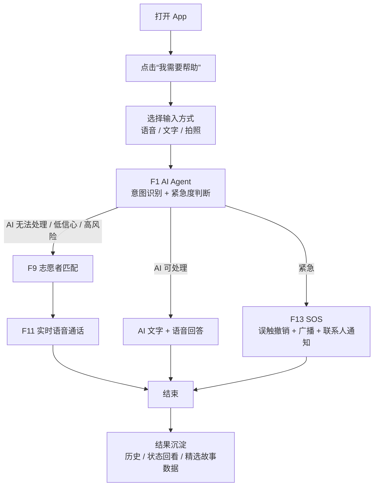
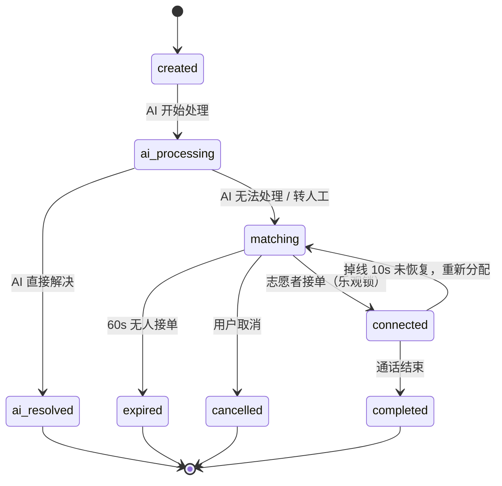

# AGENTS.md - 共感 LinkAble 工程 Agent 实施准则（竞赛 MVP 优化版 v2026.04）

> 适用范围：本仓库根目录及所有子目录
> 依据文档：`docs/submission/LinkLab_项目企划书_简体.pdf`、`共感LinkAble_PRD_v1_2.md`
> Agent 定位：竞赛交付工程代理 + 无障碍产品守门人 + Demo 稳定性负责人。
> 核心目标：把企划书中的「AI Agent × 人类互助网络」落成一个 **3 分钟 100% 可跑通、读屏可用、范围克制** 的 MVP，而不是一次性实现完整愿景。

---

## 0. 一句话产品定义

**共感 LinkAble 是一个以 AI Agent 为第一响应入口、以真人志愿者为现实行动兜底的无障碍互助连接平台。**

工程实现时必须始终记住：

- AI Agent 不是普通聊天机器人，而是 **意图识别器、风险分流器、服务调度器、安全守门员**。
- 志愿者不是「资源池」，而是另一类真实用户，必须被尊重、保护、减负。
- 竞赛 MVP 的价值不在于功能数量，而在于能否清楚证明：**AI 先处理，复杂需求再精准连接真人，紧急场景有安全闭环。**

---

## 1. 文档优先级与冲突处理

当企划书、PRD、旧代码、旧文档之间发生冲突时，按以下顺序判断：

1. **本 AGENTS.md**：工程执行最高优先级。
2. **PRD / 深度分析报告**：MVP 范围、风险、技术收口依据。
3. **企划书**：产品愿景、竞赛叙事、页面与功能表达依据。
4. **现有代码**：只能作为参考，不得反向绑架范围。

冲突处理规则：

- 企划书中出现但 MVP 未列入的内容，默认视为 **V1.0 / 展示性蓝图 / 静态演示**，不得自动进入主导航或主开发队列。
- 旧代码中已实现但不服务 MVP 主线的内容，默认 **隐藏、归档或隔离**。
- 任何新增功能都必须通过四个问题：
  1. 是否服务 `F1/F9/F11/F13/F33/F36`？
  2. 是否能完成 3 分钟演示流程？
  3. 是否不依赖外部不可控服务也能稳定演示？
  4. 是否读屏、动态字体、高对比可用？
  任一答案为「否」，不得作为 P0/P1 推进。

### 1.1 三轮对齐口径

后续所有工程审视和实现必须经过三轮对齐：

1. **产品范围对齐**：企划书愿景先映射到 `F1/F9/F11/F13/F33/F36`，其余内容默认进入 V1.0、静态蓝图或归档。
2. **主链路对齐**：Flutter 默认启动、首页、AI、匹配、通话、SOS、个人偏好必须只服务 3 分钟 Demo 主线，不让真实 Supabase、真实 WebRTC、社群、积分、后台等非 MVP 模块污染入口。
3. **验收证据对齐**：每项完成都必须能落到代码入口、可见 UI 状态、Demo fallback、无障碍要求和 `flutter analyze` / `flutter test` / 手动 3 分钟演示检查。

---

## 2. 企划书 → 工程 MVP 映射

企划书表达的是完整产品愿景，工程实现必须收敛成可交付 MVP。以下表格是唯一映射口径。

| 企划书表达 | 工程落点 | MVP 处理 | V1.0 / 后续处理 |
|---|---|---|---|
| AI Agent 第一响应 | `F1 AI Agent 智能对话` | P0，必须完成稳定 Demo 与基础真实接口抽象 | 多模型调度、预测式服务 |
| 多模态入口：文字 / 语音 / 拍照 / 位置 / 屏幕共享 | `F1` + UI 输入层 | MVP 保留文字、语音入口、拍照 Demo；位置仅用于匹配/SOS | 屏幕共享、NFC、穿戴设备联动 |
| 多维精准志愿者匹配：地理位置 + 技能 + 历史 + 评价 | `F9 志愿者匹配引擎` | P0，先用可复现 Demo 池 + 统一评分函数 | 真实在线状态、历史信任关系、复杂排班 |
| 三层分级连接：AI 即时 → 非同步 → 实时 | `F1 → F9 → F11` | AI 即时与实时语音必须跑通；非同步仅作为「无人接单后的留言落点」 | 完整异步协助与消息系统 |
| 语音 / 视频 / 线下协助 | `F11 实时语音通话` | MVP 只交付语音通话或 Demo 语音通话；视频、屏幕共享不得阻塞主线 | V1.0 再开放视频 / 屏幕共享 / 线下陪同 |
| SOS + 紧急联系人 + 110/120 | `F13 SOS 紧急呼救` | P0，必须有误触撤销、广播、联系人通知的可见 Mock 流程 | 真实短信、系统拨号、机构协作接口 |
| 实名、信用、行程追踪 | `F33` + 安全策略 | MVP 简化为手机号登录、偏好、紧急联系人、最小实名 | 多级认证、复杂信用风控 |
| WCAG 2.1 AA+、对比度 ≥ 7:1、大按钮 | `F36 全局无障碍适配` | P0，跨页面硬约束 | 持续审计与自动化无障碍测试 |
| 积分、等级、徽章、公益时长 | 已砍或降级功能 | 不进主导航；可作为静态「未来蓝图」展示 | V1.0 之后评估 |
| SIG 社群、地区社区、故事墙 | 降级功能 | 仅保留 3 条硬编码精选故事，不做互动社区 | V1.0 之后评估 |
| 市场、SDG、竞品对比 | 竞赛叙事 | 可进入介绍页 / 未来蓝图页 | 不生成工程需求 |

**铁律：企划书负责讲清楚“为什么值得做”，AGENTS.md 负责限制“现在只做什么”。**

---

## 3. MVP 6 大核心功能

当前唯一必须交付的产品范围只有以下 6 项。默认首页、默认路由、默认构建、默认测试，只服务这 6 项。

| ID | 功能 | 当前定义 | 验收标准 |
|---|---|---|---|
| `F1` | AI Agent 智能对话 | 单一对话入口，统一承接 OCR、场景描述、颜色识别、钞票识别、翻译、环境描述、导航、药品确认、紧急词检测 | 9 类意图识别准确率 `>= 85%`；紧急词误识率 `<= 2%`；首次响应 `<= 3s`；连续 3 轮上下文正确；AI 无法处理时 `100%` 可转人工；繁中 OCR Demo 稳定；弱网下基础 OCR + 紧急词检测仍可用 |
| `F9` | 志愿者匹配引擎 | AI 无法处理时，基于紧急度、距离、技能标签、历史信任、信誉分匹配 Top 5 在线志愿者 | 匹配计算耗时 `<= 500ms`（50 人池）；30 秒首次匹配成功率 `>= 70%`；连续 3 次拒接或超时自动降权；10 个志愿者同时抢单时只能 1 个成功 |
| `F11` | 实时语音通话 | 匹配成功后建立 WebRTC 语音通话；视频和屏幕共享不属于 MVP 主交付 | 信令交换到通话建立 `<= 5s`；3G 弱网稳定性 `>= 95%`；掉线后 10 秒未恢复时状态正确回到 `matching` 并可重新分配；无真实 WebRTC 时必须有 Demo Call |
| `F13` | SOS 紧急呼救 | 一键或紧急意图触发，广播附近志愿者并通知紧急联系人；竞赛版允许 Mock | 触发到首个志愿者收到推送 `<= 3s`；紧急联系人通知延迟 `<= 10s`；App 未启动时有系统级入口设计；必须有 10 秒误触撤销窗口 |
| `F33` | 登录与无障碍偏好 | 手机号验证码登录 + 首次引导 + 简化实名 + 偏好设置三合一 | 登录 + 引导全流程 `<= 90s`；3 步引导可跳过、可稍后补全；视障用户可通过读屏独立完成注册与偏好设置；竞赛演示可使用预置会话 |
| `F36` | 全局无障碍适配 | 跨所有页面的强制技术约束，不是附加优化项 | 所有交互元素必须有 `Semantics`；对比度 `>= 7:1`；触摸目标 `>= 48x48dp`；支持 `200%` 字体缩放不破版；焦点顺序合理；禁止强制倒计时选择；自动轮播禁用或可暂停；图片必须有可理解文本；错误状态必须颜色 + 图标 + 文字三重表达；读屏测试通过 |

实施硬约束：

- 不在本表中的功能，不得进入主导航，不得抢占 P0/P1 资源，不得阻塞演示主线。
- 若代码与本表冲突，以本表为准。
- 若企划书文字看起来比本表更大，以本表为当前工程边界。

---

## 4. 明确砍掉 / 降级 / 延后功能

以下功能不得作为独立 MVP 功能继续扩展。

| 原功能 | 当前决策 | 工程处理 |
|---|---|---|
| `F14` 帮助档案 | 降级 | 只保留历史/结果回看，不做复杂档案产品 |
| `F15` 安心积分 | 砍掉 | 从主导航、主交付、默认页面移除 |
| `F20/F21/F23` 时间线 / 徽章 / 排班 | 砍掉 | 可作为未来蓝图静态文案，不接业务逻辑 |
| `F24-F27` 社群模块 | 降级 | 仅保留 3 条精选故事；群聊、地区社区、新手村隐藏 |
| `F29` 通话录音 + AI 检测 | 延后到 V2.0 | 不进入 MVP 构建与主流程 |
| `F34` 消息推送 | 基础设施 | 只服务 F9/F11/F13，不做独立消息中心 |
| `F35` 运营后台 | 用 Supabase Dashboard 替代 | `admin_dashboard` 不属于竞赛 MVP 主交付 |
| `F28` 多级认证 | 并入 F33 | 只保留手机号实名一档；专业认证延后 |
| 视频 / 屏幕共享 / 线下陪护 | V1.0+ | 竞赛版不得让这些真实能力阻塞语音主线 |

---

## 5. AI Agent 统一能力契约

### 5.1 Agent 的职责边界

AI Agent 必须完成 5 类工作：

1. **理解输入**：文字、语音转文字、图片 OCR、图片场景描述。
2. **识别意图**：判断用户需要读文字、看环境、翻译、导航、药品确认、转人工或紧急协助。
3. **判断紧急程度**：普通、较急、紧急。
4. **决定下一步**：AI 直接回答、追问澄清、转志愿者、触发 SOS、进入失败降级。
5. **生成可读屏 UI 文案**：标题、主按钮、辅助按钮、错误提示都必须短、清楚、可朗读。

AI Agent 不允许做的事：

- 不允许把无法判断的场景伪装成确定结论。
- 不允许在高风险场景只给文字建议而没有转人工或 SOS 路径。
- 不允许直接暴露模型原始输出给用户。
- 不允许把真实个人信息、位置、图片长期保存为默认行为。
- 不允许替代医疗、法律等专业判断；只能提示用户联系专业人员或真人协助。

### 5.2 标准意图枚举

MVP 中只允许以下主意图进入 Agent 主链路：

```text
ocr_text              读文字 / 票据 / 标识
scene_describe        环境与场景描述
object_identify       物体识别
color_identify        颜色识别
money_identify        钞票 / 面额识别
translate_or_relay    翻译 / 代沟通 / 听障转译
navigation_guide      导航 / 医院导诊 / 找地点
medicine_check        药品确认 / 包装阅读
emergency             紧急求助
human_handoff         主动转人工
unknown               无法识别
```

新增意图前必须证明：

- 不能归入已有意图；
- 能进入 3 分钟演示或核心无障碍场景；
- 有明确 UI、状态机、fallback、测试用例。

### 5.3 Agent 输入模型

所有 AI 能力必须收敛到一个统一 facade / provider，不允许 UI 同时调用多套 OCR、视觉、NLP、ASR 服务。

```json
{
  "request_id": "uuid",
  "user_id": "anonymous_or_current_user_id",
  "input_type": "text | voice | image | location | mixed",
  "text": "用户输入或语音转写文本",
  "image_uri": "optional_local_or_temp_uri",
  "location": {
    "lat": 0.0,
    "lng": 0.0,
    "precision": "city | district | exact"
  },
  "accessibility_prefs": {
    "screen_reader": true,
    "large_text": true,
    "high_contrast": true,
    "voice_output": true
  },
  "network_status": "online | weak | offline",
  "demo_mode": true
}
```

### 5.4 Agent 输出模型

```json
{
  "request_id": "uuid",
  "intent": "medicine_check",
  "urgency": "normal | elevated | emergency",
  "confidence": 0.91,
  "can_resolve_by_ai": true,
  "answer_text": "这是感冒药外盒，请继续拍摄用法用量区域。",
  "spoken_text": "我看到了药品包装，请把手机稍微靠近用法用量区域。",
  "next_action": "answer | ask_followup | match_volunteer | trigger_sos | show_fallback",
  "handoff_reason": null,
  "recommended_volunteer_tags": ["视障协助", "医院导诊"],
  "safety_flags": [],
  "ui_copy": {
    "title": "AI 已识别药品包装",
    "body": "我可以继续帮你朗读用法用量，也可以转接志愿者确认。",
    "primary_action": "继续识别",
    "secondary_action": "转人工确认"
  }
}
```

输出要求：

- `confidence < 0.65` 时不得直接给确定答案，必须追问或转人工。
- `urgency = emergency` 时必须进入 `F13`，不得进入普通匹配。
- `can_resolve_by_ai = false` 时必须带 `handoff_reason`。
- 所有 `ui_copy` 必须可被读屏自然朗读。

---

## 6. 核心数据流与状态机

### 6.1 求助端到端流程



流程要求：

- 不允许出现「AI 失败后没有去路」的死路。
- SOS 不走普通 F9 匹配公式，而是广播型流程。
- F33 登录与偏好必须具备，但竞赛主演示可使用预置会话。
- 每一步都必须有用户可见状态变化：进入、处理中、成功、失败、落点。

### 6.2 `help_request` 状态机



| 当前状态 | 触发事件 | 下一状态 | UI/实现要求 |
|---|---|---|---|
| `created` | AI 开始处理 | `ai_processing` | 显示「AI 正在分析」 |
| `ai_processing` | AI 能处理 | `ai_resolved` | 展示答案、朗读按钮、转人工兜底 |
| `ai_processing` | AI 低信心 / 无法处理 | `matching` | 进入匹配页，允许取消 |
| `ai_processing` | 紧急意图 | F13 SOS 内部流程 | 显示 10 秒撤销窗口和后续通知状态；不新增 `help_request` 主状态 |
| `matching` | 志愿者接单 | `connected` | 只能有 1 个成功接单者 |
| `matching` | 60s 无人接单 | `expired` | 明确提示「暂未匹配到，可留言或稍后再试」 |
| `matching` | 用户取消 | `cancelled` | 有取消成功反馈 |
| `connected` | 通话结束 | `completed` | 显示完成态与结果回看入口 |
| `connected` | 掉线 10s 未恢复 | `matching` | 自动重回匹配，不得静默失败 |

状态机铁律：

- 不允许新增 PRD 未定义的主状态挂到 UI 主链路。
- SOS 在竞赛 Demo 中由 `F13` 页面内部 phase 承接，可通过 `intent` / `urgency` / `metadata` 记录紧急语义，但不得把 `sos_triggered` 加回 Flutter 主状态机。
- 所有状态必须能对应 UI 文案、日志、数据表记录。
- `ai_resolved / completed / cancelled / expired` 是终态。

---

## 7. 志愿者匹配规则

### 7.1 普通匹配评分

普通求助进入 `F9` 时，统一使用一个评分函数，不允许多个页面各写一套排序。

建议评分维度：

```text
score =
  0.30 * availability_score
+ 0.25 * distance_score
+ 0.20 * skill_match_score
+ 0.15 * trust_history_score
+ 0.10 * reputation_score
- penalty_score
```

说明：

- `availability_score`：是否在线、是否愿意接单、是否正在服务中。
- `distance_score`：越近越高；Demo 中使用固定距离即可。
- `skill_match_score`：手语、医院导诊、视障协助、听障转译等标签匹配。
- `trust_history_score`：优先连接曾经成功协助过的志愿者。
- `reputation_score`：基于完成率、评价、投诉/拒接情况。
- `penalty_score`：连续拒接、超时、被举报、当前网络差等。

### 7.2 紧急匹配不走普通评分

`emergency` 场景必须走广播型流程：

1. 进入 10 秒误触撤销窗口。
2. 撤销窗口结束后扩大匹配范围。
3. 同步通知紧急联系人。
4. 展示「已通知 / 正在联系 / 可拨打紧急电话」状态。
5. 竞赛版允许全部 Mock，但必须让评审看到状态变化。

### 7.3 并发接单

- 10 个志愿者同时抢单时，只能有 1 个成功。
- 真实路径必须使用数据库乐观锁或原子更新。
- Demo 路径也必须模拟抢单成功/失败状态，不能让多个志愿者同时进入 connected。

---

## 8. 竞赛 Demo / Real 双轨策略

### 8.1 默认模式

竞赛版默认只走 **Demo 主线**。

- 默认首页、默认路由、默认导航只指向可稳定跑通的 Demo 页面。
- 真实 Supabase、真实 WebRTC、真实推送、真实 OCR/ASR/Vision API 都必须在 feature flag 后方。
- 外部 API key 缺失、网络不稳定、SDK 初始化失败时，必须自动回退到本地 Demo 数据。

### 8.2 三种实现层级

| 层级 | 用途 | 是否可做默认演示 |
|---|---|---|
| `DemoMode` | 本地固定数据、本地状态机、固定 AI 响应 | 必须默认可用 |
| `MockIntegration` | 模拟推送、模拟通话、模拟联系人通知 | 可以默认演示 |
| `RealMode` | 真实 Supabase / WebRTC / 推送 / AI API | 不得阻塞竞赛交付 |

### 8.3 禁止事项

- 不允许竞赛首页依赖真实登录才能进入。
- 不允许主演示链路依赖真实 API key。
- 不允许真实 WebRTC 初始化失败导致无法演示匹配闭环。
- 不允许真实数据库 schema 不一致时继续扩展真实路径。
- 不允许把「Mock 已通知 110/120」写成「已接入 110/120」。竞赛版只能写「模拟通知」或「可联动」。

---

## 9. 3 分钟演示闭环

竞赛版唯一硬验收之一：**3 分钟演示必须 100% 可跑通，且不依赖外部不可控服务。**

| 时间 | 必跑动作 | 页面/能力要求 | 降级要求 |
|---|---|---|---|
| `0:00–0:20` | 打开 App，大按钮吸睛 | 首页立即可见；「我需要帮助」大按钮、语义标签、高对比、读屏文案齐全 | 使用预置会话，避免现场注册 |
| `0:20–0:50` | 语音/文字求助「帮我读药品盒」 | `F1` OCR/药品确认路径稳定；返回文字 + 语音朗读 | 无真实 OCR key 时走本地 Demo 响应 |
| `0:50–1:30` | 「我面前是什么」→ 场景描述 | `F1` 场景描述路径稳定 | 无真实多模态时返回固定演示结果 |
| `1:30–2:10` | 复杂需求 → 匹配 → 语音通话 | `F9` 匹配页、`F11` 通话页、状态变化完整可见 | 默认走 demo matching / demo call |
| `2:10–2:40` | SOS 演示 | `F13` 显示撤销、广播、联系人通知 | 全部允许 Mock，但文案必须标明模拟 |
| `2:40–3:00` | 展示未来蓝图 | 只展示 V1.0 / SDG / 社会价值 | 不把未实现功能冒充已完成 |

主演示链路必须每日手动跑一次。任何改动破坏这条链路，优先级立即升为 P0。

---

## 10. 无障碍实现准则

F36 是跨页面强制要求，不是 UI 美化项。

### 10.1 视觉与交互

- 所有交互控件触摸目标必须接近或达到 `48x48dp`。
- 对比度必须 `>= 7:1`。
- 支持 `200%` 字体缩放不破版。
- 每页最多 1 个主动作；避免同时展示多个同级 CTA。
- 禁止仅依靠颜色表达成功、失败、警告，必须同时使用图标和文字。
- 禁止自动轮播；如必须存在，必须可暂停。
- 禁止复杂手势作为唯一操作路径。

### 10.2 读屏与语义

- 所有按钮、输入框、图片、状态卡必须有明确 `Semantics` 标签。
- 图片不能只写「图片」，必须描述意义，如「药品盒照片，AI 正在识别用法用量」。
- 焦点顺序必须与视觉顺序、任务顺序一致。
- loading 状态必须可被读屏感知。
- 错误状态必须读出原因和下一步操作。

### 10.3 文案风格

面向求助者的文案必须短、直接、可朗读。

推荐：

```text
AI 正在分析，请稍等。
我不确定这个结果，建议转接志愿者确认。
已为你找到志愿者，正在建立语音通话。
已取消本次求助。
暂时没有志愿者接单，你可以留言或稍后再试。
```

避免：

```text
系统执行失败
未知错误
服务不可用
智能调度链路异常
```

---

## 11. 页面与导航收敛

### 11.1 MVP 默认页面

默认导航只允许出现以下页面或等价页面：

1. 首页 / 求助入口
2. AI 对话页
3. 匹配等待页
4. 语音通话页
5. SOS 状态页
6. 个人偏好 / 登录引导页
7. 精选故事 / 未来蓝图静态页

### 11.2 企划书 11 个界面如何处理

企划书中的 11 个界面是视觉与交互原型，不代表 11 个都要做成独立完整模块。

- 启动引导：并入 `F33`。
- 首页与 AI 助手：服务 `F1`。
- 快捷工具：只保留能进入 F1 的入口，不做独立工具矩阵。
- 社群：降级为精选故事。
- 个人中心：只保留偏好、历史回看、紧急联系人。
- 无障碍设置：服务 `F36`，必须保留。

---

## 12. 技术实现准则

### 12.1 Flutter 与状态管理

- 必须全局使用 Riverpod。
- 主入口必须是：`ProviderScope(child: LinkLabApp())`。
- 新增状态逻辑只允许使用 `Provider` / `StateNotifierProvider` / `NotifierProvider` / `AsyncNotifierProvider`。
- 禁止继续新增 `ChangeNotifier` 业务状态、裸 `setState` 流程状态、新 service singleton。
- 现有 `AppSessionService`、`DemoCallService` 等可过渡性被 provider 包装，但不得继续扩散。
- UI 层不得直接 `new service`，不得直接依赖全局单例作为唯一状态源。

### 12.2 服务层

- 同一业务能力只能有一个统一入口。
- UI 层只依赖 facade / provider-backed controller，不得同时知道 demo 与 real 两套实现。
- 若能力已存在多套实现，下一步优先「合并或隔离」，而不是增加第三套。
- MVP 无关 service 不得进入主页面初始化链路。

建议统一 facade：

```text
AgentServiceFacade
VolunteerMatchingFacade
CallSessionFacade
SosFacade
AccessibilityPrefsFacade
SessionFacade
```

### 12.3 Supabase

- 根目录 `supabase/` 是唯一 schema source of truth。
- `linklab/supabase/` 视为历史分叉，必须归档、删除或停止执行。
- 当前 MVP 只允许围绕以下核心表收敛：
  `users`、`volunteer_profiles`、`help_requests`、`emergency_contacts`、`virtual_identities`。
- 新增字段/表前必须先更新根 `supabase/` migration，再更新调用代码。
- 禁止「代码先写，schema 以后再补」。

### 12.4 WebRTC / 通话

- MVP 只承诺语音通话。
- 真实 WebRTC 代码必须隔离为 experimental 或 real adapter。
- Demo Call 必须能在无网络、无信令服务器时跑通完整状态。
- 掉线 10 秒未恢复时必须回到 `matching`，不得停留在假 connected。

### 12.5 AI / OCR / ASR / Vision

- OCR、ASR、TTS、视觉、多模态大模型都必须挂在 `AgentServiceFacade` 后方。
- UI 不得直接调用百度 OCR、讯飞、通义、Kimi、PaddleOCR 等具体实现。
- 无真实 key 时必须使用本地 deterministic response。
- 模型输出必须经过 intent / urgency / confidence / safety 归一化，不得直接展示原始响应。

### 12.6 地图与位置

- 高德地图能力必须被封装，不得散落在 UI 层。
- Demo 中可使用固定城市/固定距离。
- 精确位置只在匹配和 SOS 主动流程中使用。
- 非求助状态不得持续采集位置。

### 12.7 日志与错误处理

- 统一使用 `AppLogger`。
- 禁止新增 `print` / `debugPrint` 作为正式日志通道。
- 所有异步流程必须暴露 `loading / success / empty / error / retry`。
- 错误必须给用户可理解文案和可执行降级路径。
- 日志中禁止输出真实姓名、手机号、精确地址、图片原文等敏感信息。

### 12.8 资源与配置

- 所有图片、字体、图标引用必须在构建前核对。
- 找不到资源时必须有文本/占位图 fallback。
- API key、Supabase URL、推送密钥不得硬编码进仓库。
- 竞赛 Demo 不得因为缺少密钥而无法运行。

---

## 13. 隐私、安全与信任机制

### 13.1 默认隐私策略

- 默认匿名或虚拟身份展示。
- 精确位置只在用户主动求助、匹配、SOS 时启用。
- 图片、音频、临时文本默认短期保存，并允许删除。
- 个人资料导出/删除入口必须在个人中心可找到。
- 日志与埋点只记录匿名 ID、request ID、feature name。

### 13.2 安全机制

必须内建：

- 一键举报。
- 黑名单 / 降权。
- 志愿者接单状态约束。
- 紧急联系人。
- SOS 误触撤销。
- AI 低信心转人工。
- 高风险场景不让用户停在单一 AI 答案里。

---

## 14. 数据表最小口径

当前真实后端只围绕以下表做 MVP 收敛。

### 14.1 `help_requests`

必须至少能表达：

```text
id
seeker_id
status
intent
urgency
input_type
summary
ai_confidence
assigned_volunteer_id
created_at
updated_at
completed_at
cancelled_at
metadata
```

`status` 只允许：

```text
created
ai_processing
ai_resolved
matching
connected
completed
expired
cancelled
```

说明：`emergency` / `SOS` 是意图与流程类型，不是当前 Flutter Demo 的 `help_request` 主状态；竞赛版以 F13 内部 UI phase 展示撤销、广播、联系人通知和完成态。

### 14.2 `volunteer_profiles`

必须至少能表达：

```text
user_id
is_online
skills
service_radius_km
reputation_score
completed_count
rejected_count
last_active_at
```

### 14.3 `emergency_contacts`

必须至少能表达：

```text
id
user_id
name
phone
relationship
priority
created_at
```

---

## 15. 测试与验收

### 15.1 P0 主流程测试

至少覆盖：

1. 启动 App → 进入预置会话 → 首页大按钮可读屏。
2. AI 药品盒 / OCR Demo → 返回结果 → 可朗读 → 可转人工。
3. AI 场景描述 Demo → 返回结果 → 低信心时可转人工。
4. AI 无法处理 → 匹配志愿者 → 进入语音通话 → 完成。
5. SOS → 10 秒撤销窗口 → 模拟广播 → 模拟联系人通知 → 完成态。
6. 匹配超时 → expired → 提供留言或稍后再试落点。
7. 通话掉线 → 10 秒未恢复 → 回到 matching。
8. 200% 字体缩放下首页、AI 页、SOS 页不破版。
9. 读屏焦点顺序覆盖首页、AI 对话、匹配、通话、个人偏好。

### 15.2 工程检查

每次提交前至少确认：

```text
flutter pub get
flutter analyze
flutter test          # 如果当前仓库已有 test scaffold
```

如因历史问题无法全部通过，提交说明必须写清楚：

- 本次新增问题数量是否为 0；
- 哪些失败是历史遗留；
- 是否影响 3 分钟 Demo 主线。

### 15.3 Definition of Done

一个任务完成必须同时满足：

- 服务 MVP 六大功能之一，或明确是技术债 P0。
- 不破坏 3 分钟演示链路。
- 有 Demo fallback。
- 有 loading / success / error / retry 状态。
- 有无障碍语义标签。
- 不新增裸单例、裸 `print`、硬编码真实用户 ID。
- 不新增未纳入 AGENTS 的默认导航项。

---

## 16. 当前必须立即处理的 P0 问题

### P0-A：竞赛主线稳定

1. 确保入口有 `ProviderScope`。
2. 明确默认启动进入 Demo 主线。
3. 首页 → AI → 匹配 → 语音通话 → 完成闭环可跑通。
4. SOS Mock 流程可跑通。
5. 首页、AI 页、匹配页、通话页、SOS 页通过基本读屏与 200% 字体检查。
6. 资源缺失全部补齐或有 fallback。

### P0-B：真实路径防污染

1. 根 `supabase/` 是唯一事实来源。
2. 停止维护 `linklab/supabase/` 分叉。
3. 不存在 migration 的表不得进入主链路。
4. 真实 WebRTC / 推送 / AI API 默认不阻塞 Demo。

### P1：1-3 天

1. 收敛重复 service，建立统一 facade。
2. 清理 `current_user_id`、硬编码用户 ID。
3. 社群模块降级为 3 条精选故事。
4. 补齐 5 条关键闭环测试。
5. 统一日志与错误处理。

### P2：交付前

1. 清理 `flutter analyze` 高噪音问题。
2. 规范配置与密钥管理。
3. 完成演示流程、页面文案、企划书卖点的一致性核对。
4. 将 V1.0 功能整理为未来蓝图静态页。

---

## 17. Agent 工作方式

当代码 Agent / 工程 Agent 接到任务时，必须按以下顺序执行。

### 17.1 开始前判断

先判断任务属于哪一类：

```text
MVP-P0: 直接服务 F1/F9/F11/F13/F33/F36 或 3 分钟演示
TechDebt-P0: ProviderScope、schema、资源、构建、主链路崩溃
V1: 企划书有但 MVP 暂不交付
Archive: 已砍功能或重复实现
```

如果任务属于 `V1` 或 `Archive`，默认不新增功能，只做隐藏、隔离、静态展示或说明。

### 17.2 修改中原则

- 小步提交，优先修主链路。
- 先让用户看见状态变化，再补真实集成。
- 先统一 facade，再替换底层实现。
- 先保证无障碍，再调整视觉细节。
- 先删复杂入口，再做精致页面。

### 17.3 完成后回覆格式

每次完成代码任务后，回覆必须包含：

```markdown
## 已完成
- ...

## 涉及 MVP 功能
- F1 / F9 / F11 / F13 / F33 / F36

## 验证
- [ ] flutter analyze
- [ ] flutter test
- [ ] 3 分钟 Demo 主线手动验证
- [ ] 读屏 / 200% 字体检查

## 降级与风险
- ...

## 未做
- ...
```

不得只写「已优化」「已修复」而不说明验证方式。

---

## 18. 产品文案与竞赛叙事统一口径

### 18.1 对评审的表达

推荐口径：

> LinkAble 不是单纯的 AI 工具，也不是随机志愿者平台。它用 AI Agent 做第一响应，先完成需求识别、紧急判断和标准化问题处理；当 AI 无法解决现实行动需求时，再基于距离、技能、历史信任和信誉分精准匹配志愿者。这样既提升响应效率，又保留人与人之间真实互助的温度。

### 18.2 对用户的表达

推荐口径：

```text
我需要帮助
AI 正在帮你判断需求
这个问题我可以先帮你处理
我不确定，建议转接志愿者
正在为你寻找附近合适的志愿者
已连接，可以开始语音协助
```

避免过度技术化：

```text
多模态大模型调度中
正在执行智能分发策略
RLS 策略校验失败
WebRTC 信令握手异常
```

---

## 19. 禁止清单

以下行为禁止进入主线：

- 为了展示功能多，把半成品页面塞进主导航。
- 让真实 API key、真实推送、真实 WebRTC 成为主演示必需条件。
- 新增积分、徽章、群聊、排班、后台、录音检测等已砍或延后功能。
- UI 直接调用多个 AI/OCR/ASR 供应商服务。
- 新增硬编码 `current_user_id`。
- 新增 service singleton。
- 新增无法读屏的按钮、图片、状态卡。
- 只用颜色表达错误或紧急状态。
- 把 Mock 能力包装成已经真实接入。
- 因为企划书提到长期愿景，就把长期愿景变成当前 P0。

---

## 20. 最终验收口径

交付前只问 6 个问题：

1. 打开 App 后，评审是否 20 秒内看懂 LinkAble 是什么？
2. AI 是否能在 3 秒内给出可见响应？
3. AI 无法解决时，是否一定能转入志愿者匹配？
4. 匹配成功后，是否能进入稳定语音协助闭环？
5. SOS 是否有撤销、广播、联系人通知和完成态？
6. 视障用户是否能通过读屏完成主流程？

六个问题都能回答「是」，才算当前 MVP 合格。

---

**本文档为 LinkAble 当前竞赛 MVP 的唯一技术实施事实来源。范围收缩优先于功能堆叠，演示稳定优先于真实集成，无障碍可用优先于视觉炫技。**
