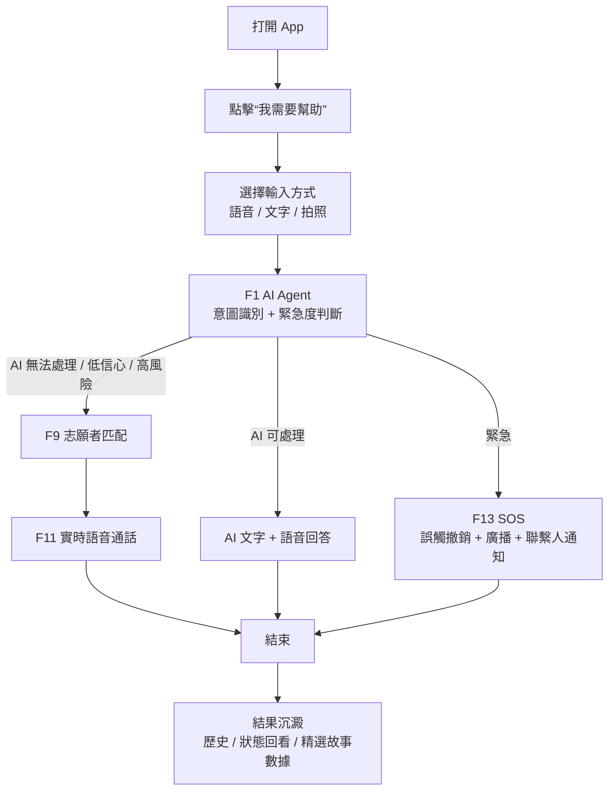
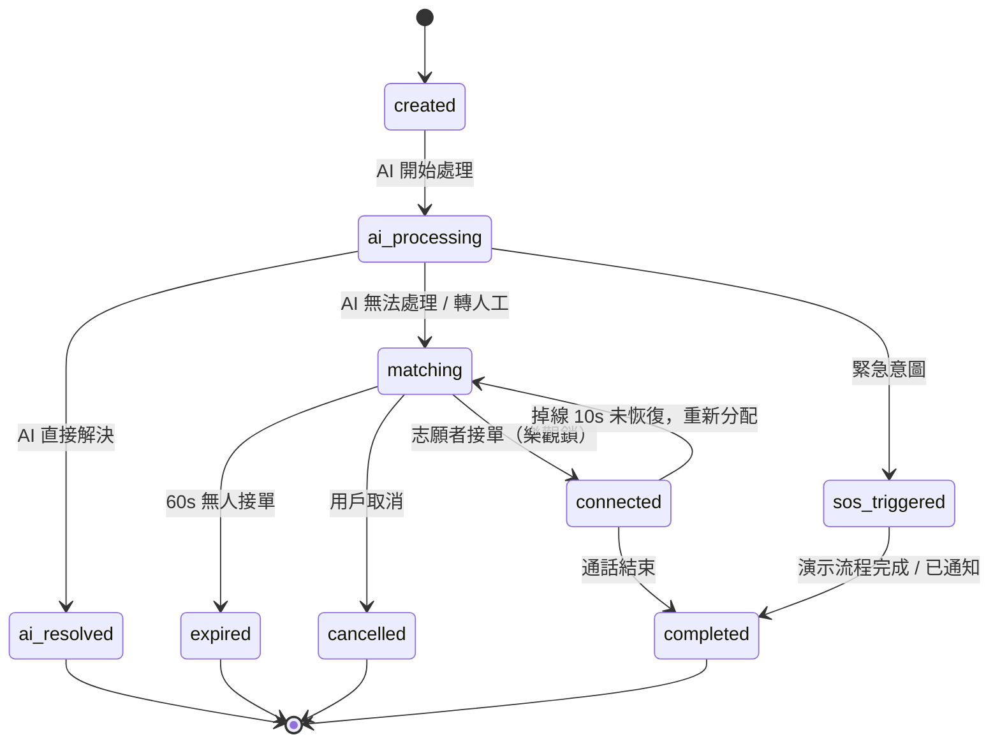

# AGENTS.md - 共感 LinkAble 工程 Agent 實施準則（競賽 MVP 優化版 v2026.04）

> 適用範圍：`E:\project\LinkLab` 整個 workspace  
> 依據文檔：`上海工程技術大學_共感LinkAble_企劃書 (2).pdf`、原 `AGENTS(5).md`、`共感LinkAble_PRD_v1_2.md`、`項目深度分析報告.md`  
> Agent 定位：競賽交付工程代理 + 無障礙產品守門人 + Demo 穩定性負責人。  
> 核心目標：把企劃書中的「AI Agent × 人類互助網絡」落成一個 **3 分鐘 100% 可跑通、讀屏可用、範圍剋制** 的 MVP，而不是一次性實現完整願景。

---

## 0. 一句話產品定義

**共感 LinkAble 是一個以 AI Agent 爲第一響應入口、以真人志願者爲現實行動兜底的無障礙互助連接平臺。**

工程實現時必須始終記住：

- AI Agent 不是普通聊天機器人，而是 **意圖識別器、風險分流器、服務調度器、安全守門員**。
- 志願者不是「資源池」，而是另一類真實用戶，必須被尊重、保護、減負。
- 競賽 MVP 的價值不在於功能數量，而在於能否清楚證明：**AI 先處理，複雜需求再精準連接真人，緊急場景有安全閉環。**

---

## 1. 文檔優先級與衝突處理

當企劃書、PRD、舊代碼、舊文檔之間發生衝突時，按以下順序判斷：

1. **本 AGENTS.md**：工程執行最高優先級。
2. **PRD / 深度分析報告**：MVP 範圍、風險、技術收口依據。
3. **企劃書**：產品願景、競賽敘事、頁面與功能表達依據。
4. **現有代碼**：只能作爲參考，不得反向綁架範圍。

衝突處理規則：

- 企劃書中出現但 MVP 未列入的內容，默認視爲 **V1.0 / 展示性藍圖 / 靜態演示**，不得自動進入主導航或主開發隊列。
- 舊代碼中已實現但不服務 MVP 主線的內容，默認 **隱藏、歸檔或隔離**。
- 任何新增功能都必須通過四個問題：  
  1. 是否服務 `F1/F9/F11/F13/F33/F36`？  
  2. 是否能進入 3 分鐘演示腳本？  
  3. 是否不依賴外部不可控服務也能穩定演示？  
  4. 是否讀屏、動態字體、高對比可用？  
  任一答案爲「否」，不得作爲 P0/P1 推進。

---

## 2. 企劃書 → 工程 MVP 映射

企劃書表達的是完整產品願景，工程實現必須收斂成可交付 MVP。以下表格是唯一映射口徑。

| 企劃書表達 | 工程落點 | MVP 處理 | V1.0 / 後續處理 |
|---|---|---|---|
| AI Agent 第一響應 | `F1 AI Agent 智能對話` | P0，必須完成穩定 Demo 與基礎真實接口抽象 | 多模型調度、預測式服務 |
| 多模態入口：文字 / 語音 / 拍照 / 位置 / 屏幕共享 | `F1` + UI 輸入層 | MVP 保留文字、語音入口、拍照 Demo；位置僅用於匹配/SOS | 屏幕共享、NFC、穿戴設備聯動 |
| 多維精準志願者匹配：地理位置 + 技能 + 歷史 + 評價 | `F9 志願者匹配引擎` | P0，先用可復現 Demo 池 + 統一評分函數 | 真實在線狀態、歷史信任關係、複雜排班 |
| 三層分級連接：AI 即時 → 非同步 → 實時 | `F1 → F9 → F11` | AI 即時與實時語音必須跑通；非同步僅作爲「無人接單後的留言落點」 | 完整異步協助與消息系統 |
| 語音 / 視頻 / 線下協助 | `F11 實時語音通話` | MVP 只交付語音通話或 Demo 語音通話；視頻、屏幕共享不得阻塞主線 | V1.0 再開放視頻 / 屏幕共享 / 線下陪同 |
| SOS + 緊急聯繫人 + 110/120 | `F13 SOS 緊急呼救` | P0，必須有誤觸撤銷、廣播、聯繫人通知的可見 Mock 流程 | 真實短信、系統撥號、機構協作接口 |
| 實名、信用、行程追蹤 | `F33` + 安全策略 | MVP 簡化爲手機號登錄、偏好、緊急聯繫人、最小實名 | 多級認證、複雜信用風控 |
| WCAG 2.1 AA+、對比度 ≥ 7:1、大按鈕 | `F36 全局無障礙適配` | P0，跨頁面硬約束 | 持續審計與自動化無障礙測試 |
| 積分、等級、徽章、公益時長 | 已砍或降級功能 | 不進主導航；可作爲靜態「未來藍圖」展示 | V1.0 之後評估 |
| SIG 社羣、地區社區、故事牆 | 降級功能 | 僅保留 3 條硬編碼精選故事，不做互動社區 | V1.0 之後評估 |
| 市場、SDG、競品對比 | 競賽敘事 | 可進入介紹頁 / 未來藍圖頁 | 不生成工程需求 |

**鐵律：企劃書負責講清楚“爲什麼值得做”，AGENTS.md 負責限制“現在只做什麼”。**

---

## 3. MVP 6 大核心功能

當前唯一必須交付的產品範圍只有以下 6 項。默認首頁、默認路由、默認構建、默認測試，只服務這 6 項。

| ID | 功能 | 當前定義 | 驗收標準 |
|---|---|---|---|
| `F1` | AI Agent 智能對話 | 單一對話入口，統一承接 OCR、場景描述、顏色識別、鈔票識別、翻譯、環境描述、導航、藥品確認、緊急詞檢測 | 9 類意圖識別準確率 `>= 85%`；緊急詞誤識率 `<= 2%`；首次響應 `<= 3s`；連續 3 輪上下文正確；AI 無法處理時 `100%` 可轉人工；繁中 OCR Demo 穩定；弱網下基礎 OCR + 緊急詞檢測仍可用 |
| `F9` | 志願者匹配引擎 | AI 無法處理時，基於緊急度、距離、技能標籤、歷史信任、信譽分匹配 Top 5 在線志願者 | 匹配計算耗時 `<= 500ms`（50 人池）；30 秒首次匹配成功率 `>= 70%`；連續 3 次拒接或超時自動降權；10 個志願者同時搶單時只能 1 個成功 |
| `F11` | 實時語音通話 | 匹配成功後建立 WebRTC 語音通話；視頻和屏幕共享不屬於 MVP 主交付 | 信令交換到通話建立 `<= 5s`；3G 弱網穩定性 `>= 95%`；掉線後 10 秒未恢復時狀態正確回到 `matching` 並可重新分配；無真實 WebRTC 時必須有 Demo Call |
| `F13` | SOS 緊急呼救 | 一鍵或緊急意圖觸發，廣播附近志願者並通知緊急聯繫人；競賽版允許 Mock | 觸發到首個志願者收到推送 `<= 3s`；緊急聯繫人通知延遲 `<= 10s`；App 未啓動時有系統級入口設計；必須有 10 秒誤觸撤銷窗口 |
| `F33` | 登錄與無障礙偏好 | 手機號驗證碼登錄 + 首次引導 + 簡化實名 + 偏好設置三合一 | 登錄 + 引導全流程 `<= 90s`；3 步引導可跳過、可稍後補全；視障用戶可通過讀屏獨立完成註冊與偏好設置；競賽演示可使用預置會話 |
| `F36` | 全局無障礙適配 | 跨所有頁面的強制技術約束，不是附加優化項 | 所有交互元素必須有 `Semantics`；對比度 `>= 7:1`；觸摸目標 `>= 48x48dp`；支持 `200%` 字體縮放不破版；焦點順序合理；禁止強制倒計時選擇；自動輪播禁用或可暫停；圖片必須有可理解文本；錯誤狀態必須顏色 + 圖標 + 文字三重表達；讀屏測試通過 |

實施硬約束：

- 不在本表中的功能，不得進入主導航，不得搶佔 P0/P1 資源，不得阻塞演示主線。
- 若代碼與本表衝突，以本表爲準。
- 若企劃書文字看起來比本表更大，以本表爲當前工程邊界。

---

## 4. 明確砍掉 / 降級 / 延後功能

以下功能不得作爲獨立 MVP 功能繼續擴展。

| 原功能 | 當前決策 | 工程處理 |
|---|---|---|
| `F14` 幫助檔案 | 降級 | 只保留歷史/結果回看，不做複雜檔案產品 |
| `F15` 安心積分 | 砍掉 | 從主導航、主交付、默認頁面移除 |
| `F20/F21/F23` 時間線 / 徽章 / 排班 | 砍掉 | 可作爲未來藍圖靜態文案，不接業務邏輯 |
| `F24-F27` 社羣模塊 | 降級 | 僅保留 3 條精選故事；羣聊、地區社區、新手村隱藏 |
| `F29` 通話錄音 + AI 檢測 | 延後到 V2.0 | 不進入 MVP 構建與主流程 |
| `F34` 消息推送 | 基礎設施 | 只服務 F9/F11/F13，不做獨立消息中心 |
| `F35` 運營後臺 | 用 Supabase Dashboard 替代 | `admin_dashboard` 不屬於競賽 MVP 主交付 |
| `F28` 多級認證 | 併入 F33 | 只保留手機號實名一檔；專業認證延後 |
| 視頻 / 屏幕共享 / 線下陪護 | V1.0+ | 競賽版不得讓這些真實能力阻塞語音主線 |

---

## 5. AI Agent 統一能力契約

### 5.1 Agent 的職責邊界

AI Agent 必須完成 5 類工作：

1. **理解輸入**：文字、語音轉文字、圖片 OCR、圖片場景描述。
2. **識別意圖**：判斷用戶需要讀文字、看環境、翻譯、導航、藥品確認、轉人工或緊急協助。
3. **判斷緊急程度**：普通、較急、緊急。
4. **決定下一步**：AI 直接回答、追問澄清、轉志願者、觸發 SOS、進入失敗降級。
5. **生成可讀屏 UI 文案**：標題、主按鈕、輔助按鈕、錯誤提示都必須短、清楚、可朗讀。

AI Agent 不允許做的事：

- 不允許把無法判斷的場景僞裝成確定結論。
- 不允許在高風險場景只給文字建議而沒有轉人工或 SOS 路徑。
- 不允許直接暴露模型原始輸出給用戶。
- 不允許把真實個人信息、位置、圖片長期保存爲默認行爲。
- 不允許替代醫療、法律等專業判斷；只能提示用戶聯繫專業人員或真人協助。

### 5.2 標準意圖枚舉

MVP 中只允許以下主意圖進入 Agent 主鏈路：

```text
ocr_text              讀文字 / 票據 / 標識
scene_describe        環境與場景描述
object_identify       物體識別
color_identify        顏色識別
money_identify        鈔票 / 面額識別
translate_or_relay    翻譯 / 代溝通 / 聽障轉譯
navigation_guide      導航 / 醫院導診 / 找地點
medicine_check        藥品確認 / 包裝閱讀
emergency             緊急求助
human_handoff         主動轉人工
unknown               無法識別
```

新增意圖前必須證明：

- 不能歸入已有意圖；
- 能進入 3 分鐘演示或核心無障礙場景；
- 有明確 UI、狀態機、fallback、測試用例。

### 5.3 Agent 輸入模型

所有 AI 能力必須收斂到一個統一 facade / provider，不允許 UI 同時調用多套 OCR、視覺、NLP、ASR 服務。

```json
{
  "request_id": "uuid",
  "user_id": "anonymous_or_current_user_id",
  "input_type": "text | voice | image | location | mixed",
  "text": "用戶輸入或語音轉寫文本",
  "image_uri": "optional_local_or_temp_uri",
  "location": {
    "lat": 0.0,
    "lng": 0.0,
    "precision": "city | district | exact"
  },
  "accessibility_prefs": {
    "screen_reader": true,
    "large_text": true,
    "high_contrast": true,
    "voice_output": true
  },
  "network_status": "online | weak | offline",
  "demo_mode": true
}
```

### 5.4 Agent 輸出模型

```json
{
  "request_id": "uuid",
  "intent": "medicine_check",
  "urgency": "normal | elevated | emergency",
  "confidence": 0.91,
  "can_resolve_by_ai": true,
  "answer_text": "這是感冒藥外盒，請繼續拍攝用法用量區域。",
  "spoken_text": "我看到了藥品包裝，請把手機稍微靠近用法用量區域。",
  "next_action": "answer | ask_followup | match_volunteer | trigger_sos | show_fallback",
  "handoff_reason": null,
  "recommended_volunteer_tags": ["視障協助", "醫院導診"],
  "safety_flags": [],
  "ui_copy": {
    "title": "AI 已識別藥品包裝",
    "body": "我可以繼續幫你朗讀用法用量，也可以轉接志願者確認。",
    "primary_action": "繼續識別",
    "secondary_action": "轉人工確認"
  }
}
```

輸出要求：

- `confidence < 0.65` 時不得直接給確定答案，必須追問或轉人工。
- `urgency = emergency` 時必須進入 `F13`，不得進入普通匹配。
- `can_resolve_by_ai = false` 時必須帶 `handoff_reason`。
- 所有 `ui_copy` 必須可被讀屏自然朗讀。

---

## 6. 核心數據流與狀態機

### 6.1 求助端到端流程



流程要求：

- 不允許出現「AI 失敗後沒有去路」的死路。
- SOS 不走普通 F9 匹配公式，而是廣播型流程。
- F33 登錄與偏好必須具備，但競賽主演示可使用預置會話。
- 每一步都必須有用戶可見狀態變化：進入、處理中、成功、失敗、落點。

### 6.2 `help_request` 狀態機



| 當前狀態 | 觸發事件 | 下一狀態 | UI/實現要求 |
|---|---|---|---|
| `created` | AI 開始處理 | `ai_processing` | 顯示「AI 正在分析」 |
| `ai_processing` | AI 能處理 | `ai_resolved` | 展示答案、朗讀按鈕、轉人工兜底 |
| `ai_processing` | AI 低信心 / 無法處理 | `matching` | 進入匹配頁，允許取消 |
| `ai_processing` | 緊急意圖 | `sos_triggered` | 顯示 10 秒撤銷窗口和後續通知狀態 |
| `matching` | 志願者接單 | `connected` | 只能有 1 個成功接單者 |
| `matching` | 60s 無人接單 | `expired` | 明確提示「暫未匹配到，可留言或稍後再試」 |
| `matching` | 用戶取消 | `cancelled` | 有取消成功反饋 |
| `connected` | 通話結束 | `completed` | 顯示完成態與結果回看入口 |
| `connected` | 掉線 10s 未恢復 | `matching` | 自動重回匹配，不得靜默失敗 |

狀態機鐵律：

- 不允許新增 PRD 未定義的主狀態掛到 UI 主鏈路。
- 所有狀態必須能對應 UI 文案、日誌、數據表記錄。
- `ai_resolved / completed / cancelled / expired` 是終態。

---

## 7. 志願者匹配規則

### 7.1 普通匹配評分

普通求助進入 `F9` 時，統一使用一個評分函數，不允許多個頁面各寫一套排序。

建議評分維度：

```text
score =
  0.30 * availability_score
+ 0.25 * distance_score
+ 0.20 * skill_match_score
+ 0.15 * trust_history_score
+ 0.10 * reputation_score
- penalty_score
```

說明：

- `availability_score`：是否在線、是否願意接單、是否正在服務中。
- `distance_score`：越近越高；Demo 中使用固定距離即可。
- `skill_match_score`：手語、醫院導診、視障協助、聽障轉譯等標籤匹配。
- `trust_history_score`：優先連接曾經成功協助過的志願者。
- `reputation_score`：基於完成率、評價、投訴/拒接情況。
- `penalty_score`：連續拒接、超時、被舉報、當前網絡差等。

### 7.2 緊急匹配不走普通評分

`emergency` 場景必須走廣播型流程：

1. 進入 10 秒誤觸撤銷窗口。
2. 撤銷窗口結束後擴大匹配範圍。
3. 同步通知緊急聯繫人。
4. 展示「已通知 / 正在聯繫 / 可撥打緊急電話」狀態。
5. 競賽版允許全部 Mock，但必須讓評審看到狀態變化。

### 7.3 併發接單

- 10 個志願者同時搶單時，只能有 1 個成功。
- 真實路徑必須使用數據庫樂觀鎖或原子更新。
- Demo 路徑也必須模擬搶單成功/失敗狀態，不能讓多個志願者同時進入 connected。

---

## 8. 競賽 Demo / Real 雙軌策略

### 8.1 默認模式

競賽版默認只走 **Demo 主線**。

- 默認首頁、默認路由、默認導航只指向可穩定跑通的 Demo 頁面。
- 真實 Supabase、真實 WebRTC、真實推送、真實 OCR/ASR/Vision API 都必須在 feature flag 後方。
- 外部 API key 缺失、網絡不穩定、SDK 初始化失敗時，必須自動回退到本地 Demo 數據。

### 8.2 三種實現層級

| 層級 | 用途 | 是否可做默認演示 |
|---|---|---|
| `DemoMode` | 本地固定數據、本地狀態機、固定 AI 響應 | 必須默認可用 |
| `MockIntegration` | 模擬推送、模擬通話、模擬聯繫人通知 | 可以默認演示 |
| `RealMode` | 真實 Supabase / WebRTC / 推送 / AI API | 不得阻塞競賽交付 |

### 8.3 禁止事項

- 不允許競賽首頁依賴真實登錄才能進入。
- 不允許主演示鏈路依賴真實 API key。
- 不允許真實 WebRTC 初始化失敗導致無法演示匹配閉環。
- 不允許真實數據庫 schema 不一致時繼續擴展真實路徑。
- 不允許把「Mock 已通知 110/120」寫成「已接入 110/120」。競賽版只能寫「模擬通知」或「可聯動」。

---

## 9. 3 分鐘演示閉環

競賽版唯一硬驗收之一：**3 分鐘演示必須 100% 可跑通，且不依賴外部不可控服務。**

| 時間 | 必跑動作 | 頁面/能力要求 | 降級要求 |
|---|---|---|---|
| `0:00–0:20` | 打開 App，大按鈕吸睛 | 首頁立即可見；「我需要幫助」大按鈕、語義標籤、高對比、讀屏文案齊全 | 使用預置會話，避免現場註冊 |
| `0:20–0:50` | 語音/文字求助「幫我讀藥品盒」 | `F1` OCR/藥品確認路徑穩定；返回文字 + 語音朗讀 | 無真實 OCR key 時走本地 Demo 響應 |
| `0:50–1:30` | 「我面前是什麼」→ 場景描述 | `F1` 場景描述路徑穩定 | 無真實多模態時返回固定演示結果 |
| `1:30–2:10` | 複雜需求 → 匹配 → 語音通話 | `F9` 匹配頁、`F11` 通話頁、狀態變化完整可見 | 默認走 demo matching / demo call |
| `2:10–2:40` | SOS 演示 | `F13` 顯示撤銷、廣播、聯繫人通知 | 全部允許 Mock，但文案必須標明模擬 |
| `2:40–3:00` | 展示未來藍圖 | 只展示 V1.0 / SDG / 社會價值 | 不把未實現功能冒充已完成 |

主演示鏈路必須每日手動跑一次。任何改動破壞這條鏈路，優先級立即升爲 P0。

---

## 10. 無障礙實現準則

F36 是跨頁面強制要求，不是 UI 美化項。

### 10.1 視覺與交互

- 所有交互控件觸摸目標必須接近或達到 `48x48dp`。
- 對比度必須 `>= 7:1`。
- 支持 `200%` 字體縮放不破版。
- 每頁最多 1 個主動作；避免同時展示多個同級 CTA。
- 禁止僅依靠顏色表達成功、失敗、警告，必須同時使用圖標和文字。
- 禁止自動輪播；如必須存在，必須可暫停。
- 禁止複雜手勢作爲唯一操作路徑。

### 10.2 讀屏與語義

- 所有按鈕、輸入框、圖片、狀態卡必須有明確 `Semantics` 標籤。
- 圖片不能只寫「圖片」，必須描述意義，如「藥品盒照片，AI 正在識別用法用量」。
- 焦點順序必須與視覺順序、任務順序一致。
- loading 狀態必須可被讀屏感知。
- 錯誤狀態必須讀出原因和下一步操作。

### 10.3 文案風格

面向求助者的文案必須短、直接、可朗讀。

推薦：

```text
AI 正在分析，請稍等。
我不確定這個結果，建議轉接志願者確認。
已爲你找到志願者，正在建立語音通話。
已取消本次求助。
暫時沒有志願者接單，你可以留言或稍後再試。
```

避免：

```text
系統執行失敗
未知錯誤
服務不可用
智能調度鏈路異常
```

---

## 11. 頁面與導航收斂

### 11.1 MVP 默認頁面

默認導航只允許出現以下頁面或等價頁面：

1. 首頁 / 求助入口
2. AI 對話頁
3. 匹配等待頁
4. 語音通話頁
5. SOS 狀態頁
6. 個人偏好 / 登錄引導頁
7. 精選故事 / 未來藍圖靜態頁

### 11.2 企劃書 11 個界面如何處理

企劃書中的 11 個界面是視覺與交互原型，不代表 11 個都要做成獨立完整模塊。

- 啓動引導：併入 `F33`。
- 首頁與 AI 助手：服務 `F1`。
- 快捷工具：只保留能進入 F1 的入口，不做獨立工具矩陣。
- 社羣：降級爲精選故事。
- 個人中心：只保留偏好、歷史回看、緊急聯繫人。
- 無障礙設置：服務 `F36`，必須保留。

---

## 12. 技術實現準則

### 12.1 Flutter 與狀態管理

- 必須全局使用 Riverpod。
- 主入口必須是：`ProviderScope(child: LinkLabApp())`。
- 新增狀態邏輯只允許使用 `Provider` / `StateNotifierProvider` / `NotifierProvider` / `AsyncNotifierProvider`。
- 禁止繼續新增 `ChangeNotifier` 業務狀態、裸 `setState` 流程狀態、新 service singleton。
- 現有 `AppSessionService`、`DemoCallService` 等可過渡性被 provider 包裝，但不得繼續擴散。
- UI 層不得直接 `new service`，不得直接依賴全局單例作爲唯一狀態源。

### 12.2 服務層

- 同一業務能力只能有一個統一入口。
- UI 層只依賴 facade / provider-backed controller，不得同時知道 demo 與 real 兩套實現。
- 若能力已存在多套實現，下一步優先「合併或隔離」，而不是增加第三套。
- MVP 無關 service 不得進入主頁面初始化鏈路。

建議統一 facade：

```text
AgentServiceFacade
VolunteerMatchingFacade
CallSessionFacade
SosFacade
AccessibilityPrefsFacade
SessionFacade
```

### 12.3 Supabase

- 根目錄 `supabase/` 是唯一 schema source of truth。
- `linklab/supabase/` 視爲歷史分叉，必須歸檔、刪除或停止執行。
- 當前 MVP 只允許圍繞以下核心表收斂：  
  `users`、`volunteer_profiles`、`help_requests`、`emergency_contacts`、`virtual_identities`。
- 新增字段/表前必須先更新根 `supabase/` migration，再更新調用代碼。
- 禁止「代碼先寫，schema 以後再補」。

### 12.4 WebRTC / 通話

- MVP 只承諾語音通話。
- 真實 WebRTC 代碼必須隔離爲 experimental 或 real adapter。
- Demo Call 必須能在無網絡、無信令服務器時跑通完整狀態。
- 掉線 10 秒未恢復時必須回到 `matching`，不得停留在假 connected。

### 12.5 AI / OCR / ASR / Vision

- OCR、ASR、TTS、視覺、多模態大模型都必須掛在 `AgentServiceFacade` 後方。
- UI 不得直接調用百度 OCR、訊飛、通義、Kimi、PaddleOCR 等具體實現。
- 無真實 key 時必須使用本地 deterministic response。
- 模型輸出必須經過 intent / urgency / confidence / safety 歸一化，不得直接展示原始響應。

### 12.6 地圖與位置

- 高德地圖能力必須被封裝，不得散落在 UI 層。
- Demo 中可使用固定城市/固定距離。
- 精確位置只在匹配和 SOS 主動流程中使用。
- 非求助狀態不得持續採集位置。

### 12.7 日誌與錯誤處理

- 統一使用 `AppLogger`。
- 禁止新增 `print` / `debugPrint` 作爲正式日誌通道。
- 所有異步流程必須暴露 `loading / success / empty / error / retry`。
- 錯誤必須給用戶可理解文案和可執行降級路徑。
- 日誌中禁止輸出真實姓名、手機號、精確地址、圖片原文等敏感信息。

### 12.8 資源與配置

- 所有圖片、字體、圖標引用必須在構建前核對。
- 找不到資源時必須有文本/佔位圖 fallback。
- API key、Supabase URL、推送密鑰不得硬編碼進倉庫。
- 競賽 Demo 不得因爲缺少密鑰而無法運行。

---

## 13. 隱私、安全與信任機制

### 13.1 默認隱私策略

- 默認匿名或虛擬身份展示。
- 精確位置只在用戶主動求助、匹配、SOS 時啓用。
- 圖片、音頻、臨時文本默認短期保存，並允許刪除。
- 個人資料導出/刪除入口必須在個人中心可找到。
- 日誌與埋點只記錄匿名 ID、request ID、feature name。

### 13.2 安全機制

必須內建：

- 一鍵舉報。
- 黑名單 / 降權。
- 志願者接單狀態約束。
- 緊急聯繫人。
- SOS 誤觸撤銷。
- AI 低信心轉人工。
- 高風險場景不讓用戶停在單一 AI 答案裏。

---

## 14. 數據表最小口徑

當前真實後端只圍繞以下表做 MVP 收斂。

### 14.1 `help_requests`

必須至少能表達：

```text
id
seeker_id
status
intent
urgency
input_type
summary
ai_confidence
assigned_volunteer_id
created_at
updated_at
completed_at
cancelled_at
metadata
```

`status` 只允許：

```text
created
ai_processing
ai_resolved
matching
connected
sos_triggered
completed
expired
cancelled
```

### 14.2 `volunteer_profiles`

必須至少能表達：

```text
user_id
is_online
skills
service_radius_km
reputation_score
completed_count
rejected_count
last_active_at
```

### 14.3 `emergency_contacts`

必須至少能表達：

```text
id
user_id
name
phone
relationship
priority
created_at
```

---

## 15. 測試與驗收

### 15.1 P0 主流程測試

至少覆蓋：

1. 啓動 App → 進入預置會話 → 首頁大按鈕可讀屏。
2. AI 藥品盒 / OCR Demo → 返回結果 → 可朗讀 → 可轉人工。
3. AI 場景描述 Demo → 返回結果 → 低信心時可轉人工。
4. AI 無法處理 → 匹配志願者 → 進入語音通話 → 完成。
5. SOS → 10 秒撤銷窗口 → 模擬廣播 → 模擬聯繫人通知 → 完成態。
6. 匹配超時 → expired → 提供留言或稍後再試落點。
7. 通話掉線 → 10 秒未恢復 → 回到 matching。
8. 200% 字體縮放下首頁、AI 頁、SOS 頁不破版。
9. 讀屏焦點順序覆蓋首頁、AI 對話、匹配、通話、個人偏好。

### 15.2 工程檢查

每次提交前至少確認：

```text
flutter pub get
flutter analyze
flutter test          # 如果當前倉庫已有 test scaffold
```

如因歷史問題無法全部通過，提交說明必須寫清楚：

- 本次新增問題數量是否爲 0；
- 哪些失敗是歷史遺留；
- 是否影響 3 分鐘 Demo 主線。

### 15.3 Definition of Done

一個任務完成必須同時滿足：

- 服務 MVP 六大功能之一，或明確是技術債 P0。
- 不破壞 3 分鐘演示鏈路。
- 有 Demo fallback。
- 有 loading / success / error / retry 狀態。
- 有無障礙語義標籤。
- 不新增裸單例、裸 `print`、硬編碼真實用戶 ID。
- 不新增未納入 AGENTS 的默認導航項。

---

## 16. 當前必須立即處理的 P0 問題

### P0-A：競賽主線穩定

1. 確保入口有 `ProviderScope`。
2. 明確默認啓動進入 Demo 主線。
3. 首頁 → AI → 匹配 → 語音通話 → 完成閉環可跑通。
4. SOS Mock 流程可跑通。
5. 首頁、AI 頁、匹配頁、通話頁、SOS 頁通過基本讀屏與 200% 字體檢查。
6. 資源缺失全部補齊或有 fallback。

### P0-B：真實路徑防污染

1. 根 `supabase/` 是唯一事實來源。
2. 停止維護 `linklab/supabase/` 分叉。
3. 不存在 migration 的表不得進入主鏈路。
4. 真實 WebRTC / 推送 / AI API 默認不阻塞 Demo。

### P1：1-3 天

1. 收斂重複 service，建立統一 facade。
2. 清理 `current_user_id`、硬編碼用戶 ID。
3. 社羣模塊降級爲 3 條精選故事。
4. 補齊 5 條關鍵閉環測試。
5. 統一日誌與錯誤處理。

### P2：交付前

1. 清理 `flutter analyze` 高噪音問題。
2. 規範配置與密鑰管理。
3. 完成演示腳本、頁面文案、企劃書賣點的一致性覈對。
4. 將 V1.0 功能整理爲未來藍圖靜態頁。

---

## 17. Agent 工作方式

當代碼 Agent / 工程 Agent 接到任務時，必須按以下順序執行。

### 17.1 開始前判斷

先判斷任務屬於哪一類：

```text
MVP-P0: 直接服務 F1/F9/F11/F13/F33/F36 或 3 分鐘演示
TechDebt-P0: ProviderScope、schema、資源、構建、主鏈路崩潰
V1: 企劃書有但 MVP 暫不交付
Archive: 已砍功能或重複實現
```

如果任務屬於 `V1` 或 `Archive`，默認不新增功能，只做隱藏、隔離、靜態展示或說明。

### 17.2 修改中原則

- 小步提交，優先修主鏈路。
- 先讓用戶看見狀態變化，再補真實集成。
- 先統一 facade，再替換底層實現。
- 先保證無障礙，再調整視覺細節。
- 先刪複雜入口，再做精緻頁面。

### 17.3 完成後回覆格式

每次完成代碼任務後，回覆必須包含：

```markdown
## 已完成
- ...

## 涉及 MVP 功能
- F1 / F9 / F11 / F13 / F33 / F36

## 驗證
- [ ] flutter analyze
- [ ] flutter test
- [ ] 3 分鐘 Demo 主線手動驗證
- [ ] 讀屏 / 200% 字體檢查

## 降級與風險
- ...

## 未做
- ...
```

不得只寫「已優化」「已修復」而不說明驗證方式。

---

## 18. 產品文案與競賽敘事統一口徑

### 18.1 對評審的表達

推薦口徑：

> LinkAble 不是單純的 AI 工具，也不是隨機志願者平臺。它用 AI Agent 做第一響應，先完成需求識別、緊急判斷和標準化問題處理；當 AI 無法解決現實行動需求時，再基於距離、技能、歷史信任和信譽分精準匹配志願者。這樣既提升響應效率，又保留人與人之間真實互助的溫度。

### 18.2 對用戶的表達

推薦口徑：

```text
我需要幫助
AI 正在幫你判斷需求
這個問題我可以先幫你處理
我不確定，建議轉接志願者
正在爲你尋找附近合適的志願者
已連接，可以開始語音協助
```

避免過度技術化：

```text
多模態大模型調度中
正在執行智能分發策略
RLS 策略校驗失敗
WebRTC 信令握手異常
```

---

## 19. 禁止清單

以下行爲禁止進入主線：

- 爲了展示功能多，把半成品頁面塞進主導航。
- 讓真實 API key、真實推送、真實 WebRTC 成爲主演示必需條件。
- 新增積分、徽章、羣聊、排班、後臺、錄音檢測等已砍或延後功能。
- UI 直接調用多個 AI/OCR/ASR 供應商服務。
- 新增硬編碼 `current_user_id`。
- 新增 service singleton。
- 新增無法讀屏的按鈕、圖片、狀態卡。
- 只用顏色表達錯誤或緊急狀態。
- 把 Mock 能力包裝成已經真實接入。
- 因爲企劃書提到長期願景，就把長期願景變成當前 P0。

---

## 20. 最終驗收口徑

交付前只問 6 個問題：

1. 打開 App 後，評審是否 20 秒內看懂 LinkAble 是什麼？
2. AI 是否能在 3 秒內給出可見響應？
3. AI 無法解決時，是否一定能轉入志願者匹配？
4. 匹配成功後，是否能進入穩定語音協助閉環？
5. SOS 是否有撤銷、廣播、聯繫人通知和完成態？
6. 視障用戶是否能通過讀屏完成主流程？

六個問題都能回答「是」，纔算當前 MVP 合格。

---

**本文檔爲 LinkAble 當前競賽 MVP 的唯一技術實施事實來源。範圍收縮優先於功能堆疊，演示穩定優先於真實集成，無障礙可用優先於視覺炫技。**
