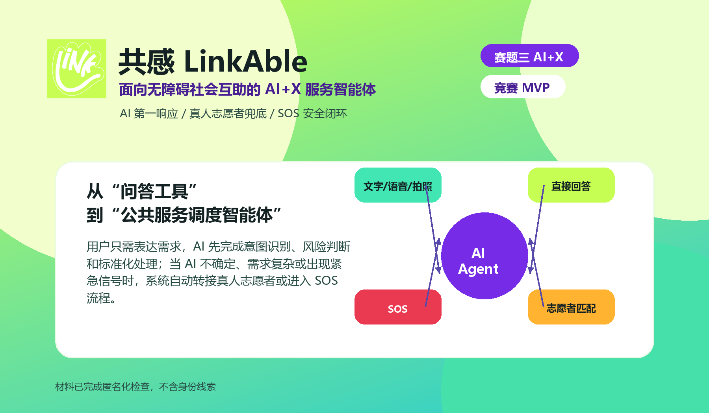

# 参赛作品简介

共感 LinkAble 是面向视障、听障、老年人及临时困难人群的 AI+无障碍互助系统。项目把 AI Agent 设计为第一响应入口，统一理解文字、语音、拍照和位置输入，先完成意图识别、风险分流、OCR/药品说明/场景描述等标准化处理；当 AI 低置信、需求复杂或出现紧急信号时，自动转接真人志愿者或进入 SOS 闭环。作品创新点在于将大模型从“问答工具”转化为“公共服务调度智能体”，用 Demo-first 架构保证无外部 API 也能稳定展示 AI 处理、志愿者匹配、语音协助、SOS 和无障碍偏好全流程。
