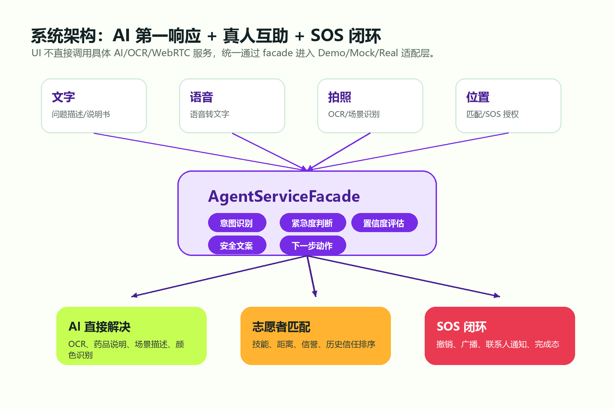
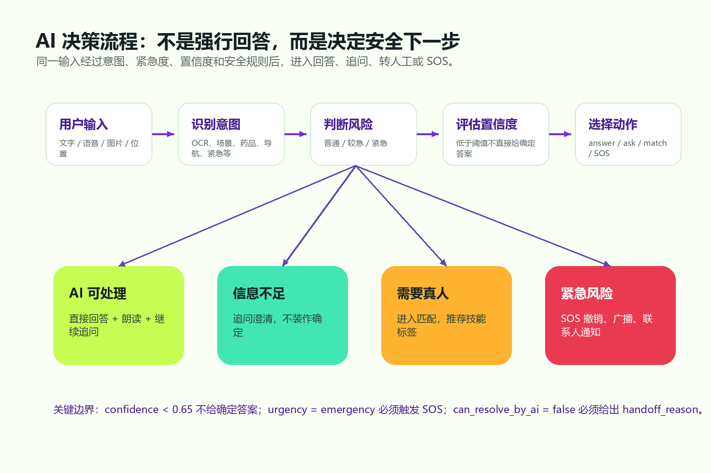
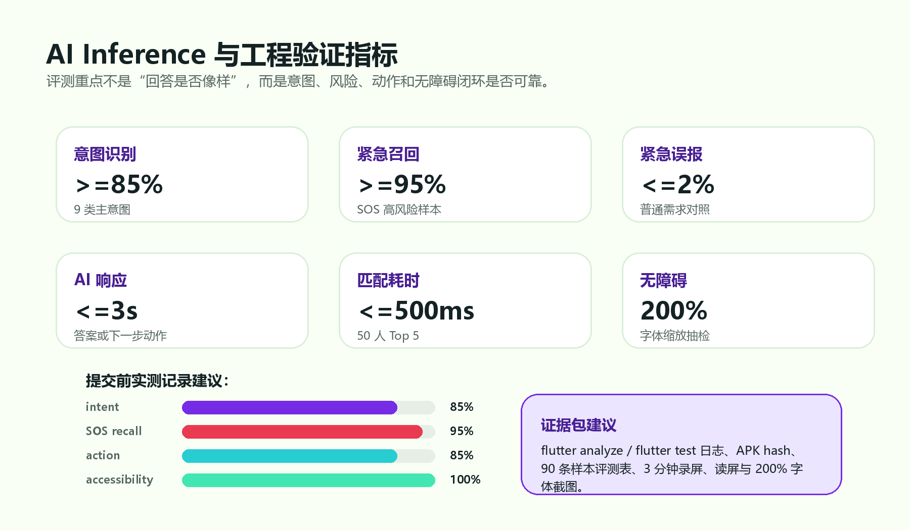

# 共感 LinkAble：面向无障碍社会互助的 AI+X 服务智能体


## 1. 作品定位与赛题适配

共感 LinkAble 面向“开放赛题 - 面向科学、工程和社会科学的 AI+X 应用”。本项目中的 X 不是单一技术模块，而是无障碍公共服务与社会互助场景：视障、听障、老年人和临时困难人群在日常生活中会遇到读文字、看环境、确认药品、理解路牌、沟通转述、紧急求助等连续问题。单纯的 AI 问答可以提供信息，但不能保证风险分流；单纯的志愿者平台可以提供人力，但需求描述不标准、响应不稳定。LinkAble 的目标是把两者组织成一个可落地的服务闭环。

项目将生成式 AI 和智能体机制引入无障碍民生服务：AI Agent 先理解输入、识别意图、判断紧急程度、完成标准化任务；当 AI 低置信、任务复杂或涉及现实行动风险时，系统再把需求结构化后转给真人志愿者；遇到紧急词和高风险场景时，进入 SOS 撤销、广播和紧急联系人通知流程。它不是“一个聊天机器人加几个按钮”，而是一个面向弱势用户的 AI 第一响应与真人互助协同系统。

### 1.1 一句话定义

共感 LinkAble 是一个以 AI Agent 为第一响应入口、以真人志愿者为现实行动兜底的无障碍互助连接平台。

### 1.2 当前 MVP 范围

| 模块 | 作用 | 演示状态 |
|---|---|---|
| AI 助手 | 统一承接文字、语音、拍照和简单问答 | 已完成本地 Demo 逻辑 |
| 药品/OCR/场景描述 | 标准化信息任务先由 AI 处理 | 已有固定演示路径 |
| 志愿者匹配 | AI 无法处理时转真人兜底 | 已完成 Demo 匹配页 |
| 语音协助 | 匹配成功后进入协助闭环 | 已完成 Demo Call |
| SOS | 紧急意图进入撤销、广播、联系人通知 | 已完成 Mock 流程 |
| 无障碍偏好 | 字体、显示、朗读、安全设置 | 已纳入主流程 |

## 2. 应用背景与问题拆解

无障碍用户的求助并不是一个单点功能问题，而是一个“从信息识别到行动确认”的连续过程。以视障用户为例，日常需求可能从“帮我读药品盒”开始，随后变成“这是不是饭后服用”“我该找谁确认”“如果我迷路了怎么办”。这类场景同时包含语言理解、视觉识别、风险判断、服务调度和人类协作。

现有方案主要存在四个断点：

| 断点 | 具体表现 | 对用户的影响 |
|---|---|---|
| 工具割裂 | OCR、语音助手、拍照识别、志愿者求助分散在不同入口 | 用户需要先判断该用哪个工具，紧急时认知负担更高 |
| AI 兜底不足 | 通用大模型容易直接给答案，但不一定判断风险 | 药品、导航、紧急场景中可能造成误导 |
| 人工响应不稳定 | 志愿者平台常依赖用户自行描述需求 | 首次沟通成本高，匹配效率低 |
| 无障碍不是硬约束 | 很多产品把大字、读屏、触控目标当作后期优化 | 真正需要帮助的用户可能无法独立完成流程 |

因此，本项目选择的不是“做更多功能”，而是建立一个清晰的主链路：用户只需表达需求，系统先由 AI 判断，再决定直接回答、追问、转人工或触发 SOS。

## 3. 核心方案



LinkAble 的核心是三层协同：

1. 输入层：承接文字、语音、拍照、位置和无障碍偏好。
2. AI 第一响应层：输出意图、紧急程度、置信度、可否由 AI 解决、下一步动作和可读屏文案。
3. 服务闭环层：根据 AI 决策进入直接回答、志愿者匹配、语音协助或 SOS。

### 3.1 AI 不是回答器，而是第一响应智能体

普通 AI 问答的目标是“给出答案”。LinkAble 的 AI Agent 目标是“给出安全的下一步”。同样是“布洛芬是什么药”，系统可以给出一般说明；如果用户问“我现在胸口疼能不能吃”，系统不能假装确定，而应提示风险并建议联系医生或真人协助。这个差异是项目的核心。

Agent 输出被标准化为：

```json
{
  "intent": "medicine_check",
  "urgency": "normal | elevated | emergency",
  "confidence": 0.91,
  "can_resolve_by_ai": true,
  "next_action": "answer | ask_followup | match_volunteer | trigger_sos",
  "ui_copy": {
    "title": "AI 已识别需求",
    "primary_action": "继续识别",
    "secondary_action": "转人工确认"
  }
}
```

这使 AI 输出可以进入工程状态机，而不是停留在不可控的自然语言文本。

### 3.2 标准化问题由 AI 先处理

AI 优先处理高频、低风险、可标准化的问题：

- 读文字、通知单、路牌、药品外盒。
- 描述环境、颜色、物体和钞票面额。
- 简单翻译、转述和说明。
- 对输入进行结构化总结，减少志愿者接单后的沟通成本。

### 3.3 复杂需求转真人志愿者

当 AI 无法稳定判断、用户主动要求真人、或问题涉及线下行动时，系统进入志愿者匹配。匹配不是简单随机派单，而是根据技能、距离、可用状态、历史信任和信誉分排序。

建议评分函数为：

```text
score =
  0.30 * availability_score
+ 0.25 * distance_score
+ 0.20 * skill_match_score
+ 0.15 * trust_history_score
+ 0.10 * reputation_score
- penalty_score
```

### 3.4 紧急场景进入 SOS 闭环

紧急求助不走普通匹配。系统检测到“救命、迷路、摔倒、着火、被困、呼吸困难”等高风险意图后，先给出误触撤销窗口，再模拟广播附近志愿者并通知紧急联系人。比赛版明确标注为“模拟通知”或“可联动”，不冒充真实报警系统。

## 4. AI 决策流程



AI 决策由四个问题串联：

1. 用户在说什么：识别输入类型与主意图。
2. 风险有多高：判断普通、较急或紧急。
3. AI 是否足够确定：根据置信度和安全规则决定是否直接回答。
4. 下一步应该由谁处理：AI 回答、追问澄清、转志愿者或触发 SOS。

这种流程把大模型能力从“内容生成”推进到“服务调度”。对评审而言，项目的技术重点不是模型参数规模，而是模型推理结果如何被工程系统安全地使用。

## 5. 创新性论证

### 5.1 从工具集合到服务智能体

现有无障碍工具往往是功能列表：OCR 是 OCR，颜色识别是颜色识别，志愿者是志愿者。LinkAble 将这些能力收敛到一个 Agent 入口，让用户不需要先选择工具，而是表达需求后由系统判断路径。

### 5.2 从 AI 回答到 AI 风险分流

项目不追求让 AI 替代专业判断。AI 的价值在于先完成需求结构化、低风险任务处理和风险识别；一旦不确定，就把任务交给人。这比“让 AI 尽量回答”更适合无障碍和公共服务场景。

### 5.3 从人工求助到精确匹配

传统人工求助往往需要用户反复解释背景。LinkAble 在转人工前已经生成意图、紧急度、摘要和推荐技能标签，让志愿者更快理解任务，降低无效沟通。

### 5.4 从炫技 Demo 到可复现演示

竞赛版默认使用 DemoMode。本地固定数据、Mock 通话和 Mock SOS 让项目在无网络、无真实 API key、无真实 WebRTC 的情况下仍能展示完整闭环。真实集成放在 feature flag 后方，避免现场展示被外部服务稳定性绑架。

### 5.5 无障碍作为系统约束

项目把读屏语义、触控目标、字体缩放、对比度、错误提示和 SOS 撤销视为 P0，而不是视觉优化。对无障碍产品来说，用户能否独立完成主流程比界面是否炫目更重要。

## 6. 技术路线与工程实现

### 6.1 总体技术栈

| 层级 | 技术/设计 | 说明 |
|---|---|---|
| 移动端 | Flutter | Android 原型与 APK 构建 |
| 状态管理 | Riverpod | 主流程状态集中管理 |
| AI 能力 | AgentServiceFacade | 统一封装 OCR、ASR、视觉、LLM 与 Demo response |
| 匹配能力 | VolunteerMatchingFacade | 统一计算候选志愿者排序 |
| 通话能力 | CallSessionFacade | Demo Call 与未来 WebRTC 适配 |
| SOS 能力 | SosFacade | 撤销、广播、联系人通知的状态机 |
| 无障碍 | Semantics + 大字体布局 | 支持读屏、动态字体和高对比 |

### 6.2 Demo/Real 双轨架构

| 模式 | 用途 | 当前策略 |
|---|---|---|
| DemoMode | 比赛默认演示 | 本地确定性数据，保证 3 分钟主线可跑 |
| MockIntegration | 模拟外部服务 | 模拟推送、通话、联系人通知 |
| RealMode | 后续真实部署 | AI API、WebRTC、推送、位置服务放在适配器后方 |

### 6.3 主要状态机

```text
created
  -> ai_processing
  -> ai_resolved / matching / SOS
matching
  -> connected / expired / cancelled
connected
  -> completed / matching
```

每个状态都对应用户可见 UI、读屏文案、失败回退和日志记录。项目避免出现“AI 失败后没有去路”的死路。

## 7. 技术调研与对比分析

| 对比对象 | 优势 | 局限 | LinkAble 的改进 |
|---|---|---|---|
| OCR/读屏类工具 | 单点功能成熟，响应快 | 不能判断是否需要真人或 SOS | 把 OCR 结果放入 Agent 决策链 |
| 通用大模型聊天 | 语言理解和内容生成强 | 缺少服务状态机和安全兜底 | 输出 intent、urgency、confidence 和 next_action |
| 志愿者互助平台 | 有人类协助能力 | 需求描述不标准，匹配慢 | AI 先整理任务，再匹配合适志愿者 |
| 医院/社区线下服务 | 可信度高 | 服务入口分散，响应时空受限 | 可作为前置分流入口，连接机构资源 |

项目的差异化不是“我们也有 AI”，而是“AI 的输出能驱动真实服务流程”。

## 8. Inference 指标与评测方案



赛题要求体现 AI 技术在 inference 上的效果和指标。LinkAble 的评测不只看回答内容，还看 AI 决策是否安全、是否能正确进入后续服务。

| 指标 | 评测对象 | 初赛目标 | 评测方法 |
|---|---|---:|---|
| 意图识别准确率 | 9 类主意图 | >= 85% | 每类 10 条样本，共 90 条 |
| 紧急意图召回率 | SOS 触发 | >= 95% | 紧急词样本 + 场景化表达 |
| 紧急误报率 | 普通需求误触发 SOS | <= 2% | 非紧急样本对照 |
| 决策动作正确率 | answer/ask/match/SOS | >= 85% | 人工标注 gold action |
| 首次可见响应时间 | UI 反馈 | <= 0.5s | stopwatch + 日志 |
| AI 完整响应时间 | 结果展示 | <= 3s | 本地 Demo 与真实接口分别记录 |
| 匹配计算耗时 | 50 人候选池 | <= 500ms | 本地排序基准测试 |
| 无障碍通过率 | 主流程页面 | 核心页面通过 | 200% 字体、读屏焦点、48dp 触控抽检 |

当前 MVP 已具备评测所需的本地样本和状态记录基础。提交前建议将评测结果导出为表格，放入其他辅助材料中，并用截图证明 `flutter analyze`、`flutter test` 和 APK 构建状态。

## 9. 数据、行业知识、算法与硬件来源

### 9.1 数据来源

- Demo 数据：团队自建的无敏感信息样例，包括药品说明、路牌、场景描述、紧急词和志愿者标签。
- 评测样本：建议自建匿名文本样本集，不采集真实姓名、手机号、精确位置和图片原文。
- 用户画像：以视障、听障、老年人、临时行动困难者的典型任务为依据。

### 9.2 行业知识来源

- 无障碍交互规范：读屏语义、动态字体、触控目标、对比度和错误提示。
- 公共安全边界：紧急求助应有撤销、确认、联系人通知和可追踪状态。
- 医疗安全边界：药品相关问题只做说明辅助，不做诊断和处方建议。

### 9.3 算法来源

- 意图识别：关键词规则 + 可扩展 LLM 分类 prompt + 本地确定性 Demo response。
- 风险判断：紧急词规则、置信度阈值、药品/导航/现实行动风险规则。
- 志愿者匹配：可用性、距离、技能匹配、历史信任、信誉分的加权排序。
- 通话与 SOS：状态机驱动，真实 WebRTC 和推送为后续 RealMode 适配。

### 9.4 硬件来源

当前 MVP 依赖普通 Android 手机即可运行。使用摄像头、麦克风、扬声器、触屏和系统读屏能力；竞赛 Demo 不依赖专用硬件。

## 10. 初期成果


当前原型已经形成“AI 先处理，复杂需求转真人，紧急场景走 SOS”的演示闭环：

1. 首页：展示项目定位和预置会话，避免现场注册阻塞演示。
2. AI 助手：支持药品问答、OCR/场景描述、紧急词检测和转人工。
3. 志愿者匹配：AI 无法处理或用户主动要求时进入匹配页。
4. Demo Call：模拟接通、通话中、结束和返回状态。
5. SOS：展示误触撤销、模拟广播和紧急联系人通知。
6. 我的/偏好：展示字体、显示、朗读和安全设置。
7. 构建产物：已生成 Android release APK，可用于真机演示。

## 11. 隐私、安全与伦理

本项目服务对象可能处于弱势或高风险状态，因此安全边界必须前置：

- AI 不替代医生、法律顾问或紧急救援人员。
- 药品和医疗相关问题只做说明辅助，并提供真人确认路径。
- 低置信、高风险、现实行动需求必须转人工或 SOS。
- Demo 不保存真实姓名、手机号、精确地址和图片原文。
- 真实部署时精确位置仅在求助、匹配、SOS 中主动授权使用。
- 日志只记录匿名 ID、request ID、功能名和状态，不记录敏感内容。

## 12. 应用落地价值

### 12.1 对用户

用户不需要理解“我该打开 OCR、相机、语音助手还是求助平台”，只需要表达需求。系统先给出快速响应，再在需要时连接真人。

### 12.2 对志愿者

AI 先完成任务摘要、风险判断和技能标签推荐，志愿者接单时看到的是结构化需求，减少重复询问和无效沟通。

### 12.3 对社区和公共机构

项目可作为社区、医院、校园、交通枢纽和政务服务大厅的无障碍前置入口，帮助机构把高频低风险问题交给 AI，把复杂和紧急需求交给真人。

### 12.4 对 AI+X 研究

LinkAble 展示了 AI 不只是内容生成工具，也可以成为公共服务中的分流、调度和安全守门员。它连接了模型 inference、移动端工程、服务流程设计和社会互助组织。

## 13. 后续计划

| 阶段 | 目标 |
|---|---|
| 初赛提交前 | 补齐 90 条意图评测、紧急词评测、APK hash、测试日志和演示视频 |
| 决赛前 | 接入真实 LLM/Vision adapter，完善匹配评分和真机读屏测试 |
| V1.0 | 接入真实 WebRTC、推送、位置授权和志愿者在线状态 |
| V2.0 | 与社区、医院、校园和公益组织开展小规模试点 |

## 14. 参考资料

- 中国研究生创新实践系列大赛官网：https://cpipc.acge.org.cn/
- 世界卫生组织 Disability overview：https://www.who.int/health-topics/disability
- W3C WCAG 2.1：https://www.w3.org/TR/WCAG21/
- 项目本地代码与文档：`linklab/`、`docs/`、`prd-analysis/`
