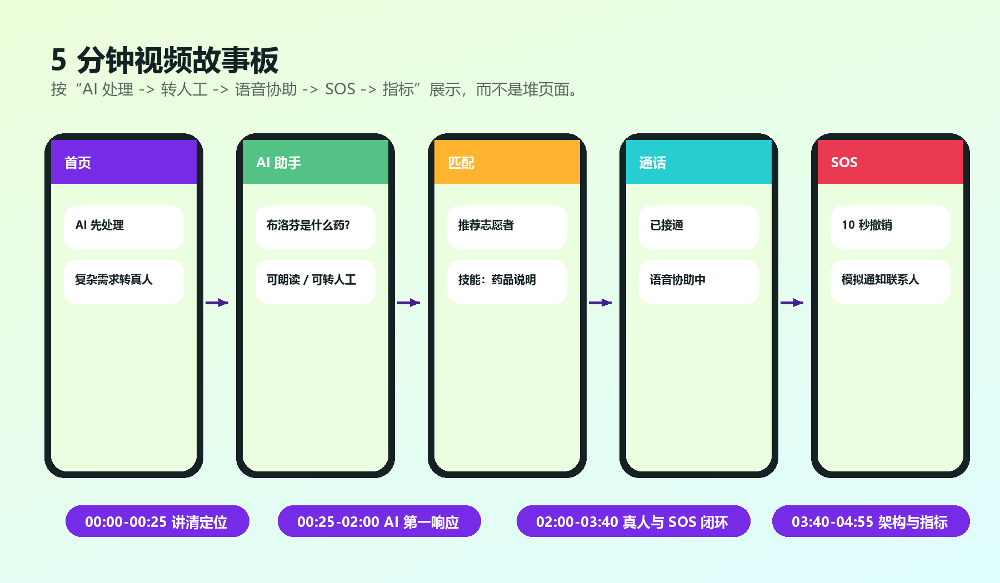

# 项目视频脚本



## 1. 视频定位

视频目标不是把所有页面快速点一遍，而是在 5 分钟内让评审看懂三件事：

1. LinkAble 解决的不是普通聊天问题，而是无障碍即时求助。
2. AI Agent 先判断、先处理、先分流，复杂需求再转真人。
3. 竞赛 MVP 已经具备可复现的 AI、匹配、语音协助、SOS 和无障碍闭环。

建议时长控制在 4 分 40 秒到 4 分 55 秒之间，给压缩和片尾留余量。

## 2. 总体节奏

| 时间 | 画面 | 口播重点 |
|---|---|---|
| 0:00-0:25 | 封面 + 首页 | 一句话定位：AI 第一响应 + 真人互助 + SOS 安全闭环 |
| 0:25-1:15 | AI 药品/OCR 问答 | 标准化问题先由 AI 处理，支持朗读和转人工 |
| 1:15-2:00 | 场景描述/低置信 | AI 不强答，低置信或复杂任务进入转人工 |
| 2:00-2:55 | 志愿者匹配 + Demo Call | AI 把需求结构化后匹配合适志愿者 |
| 2:55-3:40 | SOS 流程 | 紧急场景不走普通匹配，展示撤销、广播、联系人通知 |
| 3:40-4:25 | 架构与指标 | 展示 Agent 决策、指标体系和 Demo-first 工程策略 |
| 4:25-4:55 | 总结 | 回扣 AI+X、社会价值、可落地性 |

## 3. 详细分镜与口播

### 0:00-0:25 开场

画面：

- 使用 `assets/cover_banner.png` 作为开场视觉。
- 随后切到 App 首页，停留 3 秒，让评审看到“共感 LinkAble”和主入口。

口播：

> 共感 LinkAble 是面向视障、听障、老年人及临时困难人群的 AI+无障碍互助系统。我们的核心思路是：AI 先做第一响应，能解决的标准化问题立即解决；AI 不确定、需求复杂或出现紧急情况时，再转接真人志愿者或进入 SOS 安全闭环。

字幕关键词：

```text
AI 第一响应 / 真人志愿者兜底 / SOS 安全闭环 / 无障碍优先
```

### 0:25-1:15 AI 药品与文字说明

画面：

- 进入 AI 助手页。
- 输入或点击示例：“布洛芬是什么药？”、“帮我读药品盒”。
- 展示 AI 回答、朗读按钮、转人工按钮。

口播：

> 对视障和老年用户来说，药品说明、通知单、路牌和包装文字都是高频需求。如果每次都直接找人，响应慢、成本高；如果只靠普通聊天，风险又不可控。LinkAble 把这些标准化问题先交给 AI 处理，并且保留“转人工确认”的兜底入口。

拍摄提示：

- 不要只展示一条长回答，重点拍到“AI 已处理”和“可转人工”两个状态。
- 药品场景不要说“给出诊断”，要说“说明辅助、建议确认”。

### 1:15-2:00 场景描述与低置信分流

画面：

- 输入：“我面前是什么？”或点击“场景描述”。
- 展示 AI 场景描述。
- 再输入：“我还是不确定，需要真人帮我确认。”
- 页面进入匹配准备状态。

口播：

> AI 的职责不是强行回答所有问题，而是做风险分流。系统会识别意图、判断紧急程度和置信度。低置信、现实行动、导航和药品确认等场景，会被转入志愿者匹配，避免用户被困在不确定的机器答案里。

字幕关键词：

```text
intent / urgency / confidence / next_action
```

### 2:00-2:55 志愿者匹配与语音协助

画面：

- 展示匹配页：候选志愿者、技能标签、距离或响应状态。
- 点击进入 Demo Call。
- 展示“已接通”“语音协助中”“通话结束”。

口播：

> 当 AI 判断需要真人兜底时，系统会把需求整理成结构化信息，再基于任务类型、技能标签、距离、可用状态和信誉分匹配志愿者。比赛版本使用 Demo Call，保证无真实 WebRTC、无外部 API 时也能稳定展示协助闭环。

拍摄提示：

- 匹配页至少停留 5 秒，让评审看到“为什么是这个志愿者”。
- 通话页要展示状态变化，不要只展示静态页面。

### 2:55-3:40 SOS 安全闭环

画面：

- 触发 SOS 或输入“我迷路了，天黑了，救命”。
- 展示 10 秒撤销窗口。
- 展示“模拟广播附近志愿者”“模拟通知紧急联系人”。

口播：

> 紧急场景不走普通匹配。检测到救命、摔倒、迷路、着火等高风险意图后，系统进入 SOS 流程。为了避免误触，先给撤销窗口；确认后再展示广播和联系人通知状态。比赛版明确标注为模拟通知，不冒充真实报警系统。

必须避免：

- 不要说“已经接入 110/120”。
- 不要展示真实联系人和真实电话。

### 3:40-4:25 架构与指标

画面：

- 切入 `assets/system_architecture.png`。
- 切入 `assets/ai_decision_flow.png`。
- 切入 `assets/metrics_dashboard.png`。

口播：

> 技术上，我们将所有 AI 能力收敛到 AgentServiceFacade，输出意图、紧急程度、置信度和下一步动作。评测不只看回答是否像样，还看意图识别、紧急召回、误报率、响应时延、匹配耗时和无障碍表现。DemoMode、MockIntegration 和 RealMode 分离，保证比赛演示稳定，也为后续真实部署留出接口。

### 4:25-4:55 总结

画面：

- 首页、AI、匹配、通话、SOS 五个画面快切。
- 结尾回到封面视觉。

口播：

> 共感 LinkAble 的价值不是让 AI 取代人，而是让 AI 更快理解需求、判断风险、完成标准化处理，再把真正需要人类帮助的问题交给志愿者。它把人工智能落到无障碍公共服务这个真实场景中，用 AI+X 的方式提高响应效率，也保留人与人之间的可靠互助。

## 4. 录制检查清单

- [ ] 视频不超过 5 分钟，文件不超过 200M。
- [ ] 开头 25 秒讲清项目定位。
- [ ] 展示 AI 直接回答和可转人工兜底。
- [ ] 展示至少一次志愿者匹配。
- [ ] 展示 Demo Call 状态变化。
- [ ] 展示 SOS 撤销、广播和联系人通知。
- [ ] 展示架构图和指标图，不只拍 UI。
- [ ] 不出现学校、学院、导师、真实手机号、真实地址。
- [ ] 手机通知栏、录屏账号、系统相册等隐私信息已遮挡。

## 5. 后期包装建议

- 开场和结尾使用统一封面，不要用纯黑底白字。
- 每段加 1 行短字幕，避免评审在无声环境下看不懂。
- UI 操作不要过快，关键状态至少停留 3 秒。
- 对“模拟通知”“Demo Call”保持诚实表达，体现工程可靠性而不是夸大能力。
