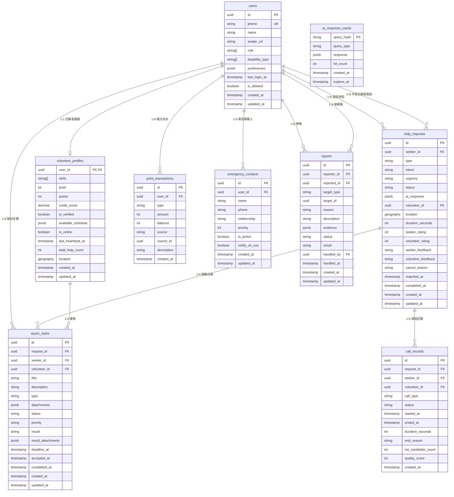

# 共感 LinkAble 數據庫設計文檔

## 數據庫關係圖

## 表結構詳細說明

### 1. users (用戶基礎表)

| 字段 | 類型 | 說明 |
|------|------|------|
| id | UUID | 主鍵，用戶唯一標識 |
| phone | TEXT | 手機號，用於登錄，唯一 |
| name | TEXT | 用戶暱稱 |
| avatar_url | TEXT | 頭像URL |
| role | TEXT[] | 角色數組：seeker(求助者), volunteer(志願者)，支持雙角色 |
| disability_type | TEXT[] | 障礙類型：visual(視障), hearing(聽障), physical(肢體), elderly(老年), temporary(臨時) |
| preferences | JSONB | 無障礙偏好配置 |
| last_login_at | TIMESTAMPTZ | 最後登錄時間 |
| is_deleted | BOOLEAN | 軟刪除標記 |

### 2. volunteer_profiles (志願者擴展表)

| 字段 | 類型 | 說明 |
|------|------|------|
| user_id | UUID | 主鍵/外鍵，關聯users.id |
| skills | TEXT[] | 技能標籤：medical(醫療), guide(導盲), tech(技術), sign(手語), elderly(敬老), child(兒童), daily(日常) |
| level | INT | 等級1-7，根據積分自動計算 |
| points | INT | 當前積分 |
| credit_score | DECIMAL(2,1) | 信用分1-5 |
| is_verified | BOOLEAN | 是否實名認證 |
| available_schedule | JSONB | 可服務時間段配置 |
| is_online | BOOLEAN | 在線狀態 |
| last_heartbeat_at | TIMESTAMPTZ | 最後心跳時間 |
| total_help_count | INT | 累計幫助次數 |
| location | GEOGRAPHY(POINT,4326) | 實時位置座標(WGS84) |

### 3. help_requests (求助記錄表)

| 字段 | 類型 | 說明 |
|------|------|------|
| id | UUID | 主鍵 |
| seeker_id | UUID | 求助者ID |
| type | TEXT | 類型：ai_auto, async, realtime_voice, realtime_video, sos |
| intent | TEXT | AI識別的意圖 |
| urgency | TEXT | 緊急程度：normal, important, urgent, emergency |
| status | TEXT | 狀態：pending, ai_resolved, matching, matched, connected, completed, cancelled |
| ai_response | JSONB | AI處理結果緩存 |
| volunteer_id | UUID | 匹配的志願者ID |
| location | GEOGRAPHY(POINT,4326) | 求助位置 |
| duration_seconds | INT | 通話時長(秒) |
| seeker_rating | INT | 求助者給志願者的評分1-5 |
| volunteer_rating | INT | 志願者給求助者的評分1-5 |
| matched_at | TIMESTAMPTZ | 匹配成功時間 |
| completed_at | TIMESTAMPTZ | 完成時間 |

### 4. async_tasks (異步任務表)

| 字段 | 類型 | 說明 |
|------|------|------|
| id | UUID | 主鍵 |
| request_id | UUID | 關聯的求助記錄ID |
| seeker_id | UUID | 求助者ID |
| volunteer_id | UUID | 接單的志願者ID |
| title | TEXT | 任務標題 |
| description | TEXT | 任務描述 |
| type | TEXT | 類型：ocr, scene_desc, translation, guidance, other |
| status | TEXT | 狀態：pending, accepted, processing, completed, cancelled, expired |
| priority | TEXT | 優先級：low, normal, high, urgent |
| result | TEXT | 處理結果 |
| deadline_at | TIMESTAMPTZ | 截止時間 |

### 5. point_transactions (積分流水錶)

| 字段 | 類型 | 說明 |
|------|------|------|
| id | UUID | 主鍵 |
| user_id | UUID | 用戶ID |
| type | TEXT | 類型：earn(獲得), spend(消耗), bonus(獎勵), penalty(扣除) |
| amount | INT | 積分變化量(正數增加，負數減少) |
| balance | INT | 變動後餘額 |
| source | TEXT | 來源：help_complete, task_complete, sign_in, exchange, system |
| source_id | UUID | 關聯記錄ID |

### 6. emergency_contacts (緊急聯繫人表)

| 字段 | 類型 | 說明 |
|------|------|------|
| id | UUID | 主鍵 |
| user_id | UUID | 用戶ID |
| name | TEXT | 聯繫人姓名 |
| phone | TEXT | 聯繫人電話 |
| relationship | TEXT | 關係 |
| priority | INT | 優先級(1最高) |
| is_active | BOOLEAN | 是否啓用 |
| notify_on_sos | BOOLEAN | SOS時是否通知 |

### 7. reports (舉報表)

| 字段 | 類型 | 說明 |
|------|------|------|
| id | UUID | 主鍵 |
| reporter_id | UUID | 舉報人ID |
| reported_id | UUID | 被舉報人ID |
| target_type | TEXT | 舉報對象類型：user, help_request, async_task |
| target_id | UUID | 舉報對象ID |
| reason | TEXT | 舉報原因：harassment, fraud, inappropriate, spam, other |
| description | TEXT | 詳細描述 |
| evidence | JSONB | 證據附件 |
| status | TEXT | 狀態：pending, investigating, resolved, rejected |
| result | TEXT | 處理結果 |
| handled_by | UUID | 處理人ID |
| handled_at | TIMESTAMPTZ | 處理時間 |

### 8. call_records (通話記錄表)

| 字段 | 類型 | 說明 |
|------|------|------|
| id | UUID | 主鍵 |
| request_id | UUID | 關聯的求助記錄ID |
| seeker_id | UUID | 求助者ID |
| volunteer_id | UUID | 志願者ID |
| call_type | TEXT | 通話類型：voice, video |
| status | TEXT | 狀態：initiated, connected, ended, failed |
| started_at | TIMESTAMPTZ | 開始時間 |
| ended_at | TIMESTAMPTZ | 結束時間 |
| duration_seconds | INT | 通話時長(秒) |
| end_reason | TEXT | 結束原因：normal, network_error, user_hangup, timeout |
| ice_candidate_count | INT | ICE候選數量(網絡質量指標) |
| quality_score | INT | 通話質量評分1-5 |

### 9. ai_response_cache (AI響應緩存表)

| 字段 | 類型 | 說明 |
|------|------|------|
| query_hash | TEXT | 主鍵，查詢內容的哈希值 |
| query_type | TEXT | 查詢類型：ocr, scene_desc, asr, translation |
| response | JSONB | AI響應結果 |
| hit_count | INT | 命中次數 |
| created_at | TIMESTAMPTZ | 創建時間 |
| expires_at | TIMESTAMPTZ | 過期時間 |

## 索引列表

### 性能關鍵索引

| 表名 | 索引名 | 類型 | 用途 |
|------|--------|------|------|
| users | idx_users_phone | B-Tree | 手機號登錄查詢，支持快速用戶認證 |
| users | idx_users_role | GIN | 角色篩選，支持多角色查詢 |
| users | idx_users_created_at | B-Tree | 用戶註冊時間排序 |
| volunteer_profiles | idx_volunteer_location | GIST | 地理位置空間查詢，用於附近志願者匹配 |
| volunteer_profiles | idx_volunteer_online | B-Tree | 在線志願者查詢，配合is_online字段 |
| volunteer_profiles | idx_volunteer_skills | GIN | 技能標籤匹配，支持多技能篩選 |
| volunteer_profiles | idx_volunteer_points | B-Tree | 積分排行查詢 |
| volunteer_profiles | idx_volunteer_heartbeat | B-Tree | 清理離線志願者時查詢 |
| help_requests | idx_help_status_urgency | B-Tree | 匹配查詢，按狀態和緊急程度篩選 |
| help_requests | idx_help_location | GIST | 附近求助空間查詢 |
| help_requests | idx_help_seeker_id | B-Tree | 查詢用戶的求助歷史 |
| help_requests | idx_help_volunteer_id | B-Tree | 查詢志願者的幫助記錄 |
| help_requests | idx_help_created_at | B-Tree | 求助記錄時間排序 |
| async_tasks | idx_async_status | B-Tree | 任務隊列查詢，按狀態篩選 |
| async_tasks | idx_async_volunteer_id | B-Tree | 查詢志願者的任務列表 |
| async_tasks | idx_async_deadline | B-Tree | 即將過期任務提醒 |
| point_transactions | idx_points_user_id | B-Tree | 查詢用戶積分流水 |
| point_transactions | idx_points_created_at | B-Tree | 積分記錄時間排序 |
| emergency_contacts | idx_emergency_user_id | B-Tree | 查詢用戶的緊急聯繫人 |
| reports | idx_reports_status | B-Tree | 待處理舉報查詢 |
| reports | idx_reports_target | B-Tree | 查詢針對特定對象的舉報 |
| call_records | idx_call_request_id | B-Tree | 查詢求助關聯的通話記錄 |
| ai_response_cache | idx_cache_expires | B-Tree | 清理過期緩存 |

## RLS策略摘要

### 策略詳細說明

| 表名 | 策略名 | 操作 | 說明 |
|------|--------|------|------|
| users | user_self_full_access | ALL | 用戶只能修改自己的數據，`auth.uid() = id` |
| users | user_public_read | SELECT | 認證用戶可查看其他用戶基本信息，排除敏感字段 |
| volunteer_profiles | volunteer_self_access | ALL | 志願者管理自己的資料，`auth.uid() = user_id` |
| volunteer_profiles | volunteer_public_read | SELECT | 公開信息(不含精確位置)，僅返回必要字段 |
| volunteer_profiles | volunteer_location_for_matching | SELECT | 匹配過程中求助者可查看位置，需通過匹配驗證 |
| help_requests | help_seeker_access | ALL | 求助者管理自己的求助，`auth.uid() = seeker_id` |
| help_requests | help_volunteer_access | SELECT,UPDATE | 志願者查看和更新分配到的求助，`auth.uid() = volunteer_id` |
| async_tasks | task_seeker_access | ALL | 求助者管理自己的任務 |
| async_tasks | task_volunteer_access | SELECT,UPDATE | 志願者查看和接受任務 |
| point_transactions | points_self_read | SELECT | 用戶只能查看自己的積分流水 |
| emergency_contacts | emergency_self_access | ALL | 用戶管理自己的緊急聯繫人 |
| reports | reporter_access | SELECT,INSERT | 舉報人可查看自己提交的舉報 |
| reports | admin_access | ALL | 管理員可處理所有舉報 |
| call_records | call_participant_access | SELECT | 通話參與者可查看記錄 |
| ai_response_cache | public_read | SELECT | 所有認證用戶可讀緩存 |

## 觸發器和函數

### 數據庫觸發器

| 觸發器名 | 表名 | 觸發時機 | 功能說明 |
|----------|------|----------|----------|
| trg_update_volunteer_level | volunteer_profiles | AFTER UPDATE | 根據積分自動計算志願者等級 (1-7級) |
| trg_update_help_count | help_requests | AFTER UPDATE | 求助完成時更新志願者的累計幫助次數 |
| trg_calculate_credit_score | help_requests | AFTER UPDATE | 根據評分自動計算志願者信用分 |
| trg_task_expired_check | async_tasks | BEFORE UPDATE | 檢查任務是否已過期，自動更新狀態 |
| trg_user_soft_delete | users | BEFORE UPDATE | 軟刪除時清理敏感信息 |
| trg_cache_hit_increment | ai_response_cache | BEFORE SELECT | 緩存命中時自動增加hit_count |

### 數據庫函數

| 函數名 | 參數 | 返回值 | 功能說明 |
|--------|------|--------|----------|
| calculate_volunteer_level | points INT | INT | 根據積分計算等級：1級(0-99), 2級(100-299), 3級(300-599), 4級(600-999), 5級(1000-1499), 6級(1500-2099), 7級(2100+) |
| calculate_credit_score | ratings INT[] | DECIMAL | 根據歷史評分計算信用分(1-5分) |
| find_nearest_volunteers | lat FLOAT, lng FLOAT, radius_meters INT, skills TEXT[] | TABLE | 查找附近符合條件的志願者 |
| get_user_points_balance | user_id UUID | INT | 獲取用戶當前積分餘額 |
| add_point_transaction | user_id UUID, type TEXT, amount INT, source TEXT, source_id UUID | VOID | 添加積分流水並更新餘額 |
| cleanup_expired_cache | VOID | INT | 清理過期的AI緩存，返回清理數量 |

### Edge Functions

| 函數名 | 功能 | 觸發方式 |
|--------|------|----------|
| matching-engine | 志願者匹配算法 | HTTP POST |
| ai-dispatcher | AI服務調度(OCR/ASR/TTS/VL) | HTTP POST |
| push-notifier | 推送通知(FCM) | HTTP POST |
| points-calculator | 積分計算和等級更新 | HTTP POST / Webhook |
